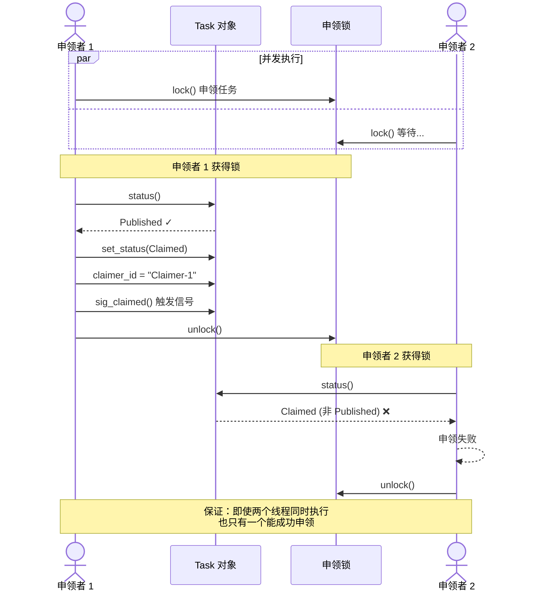
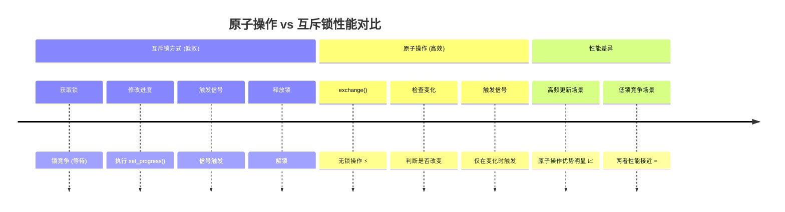
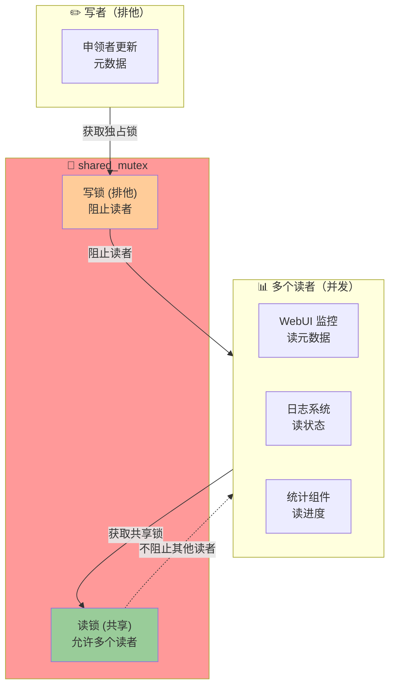
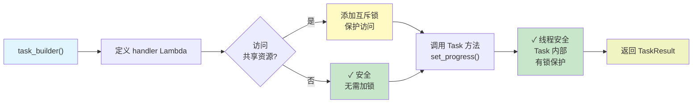
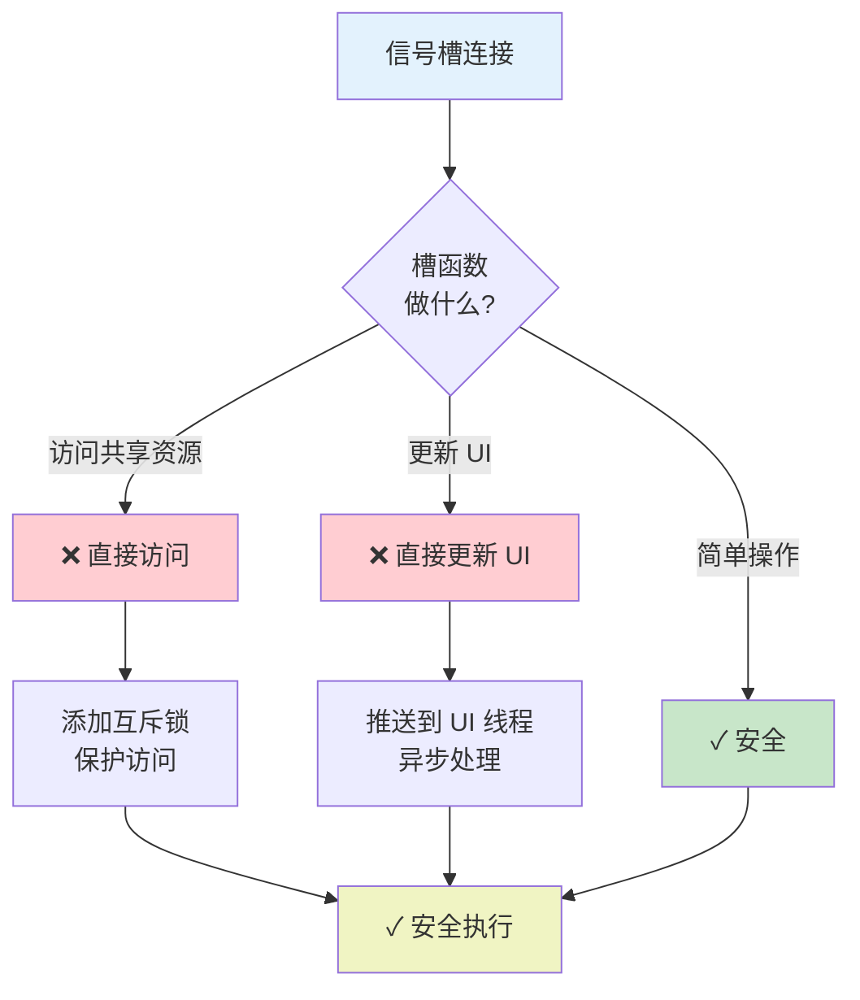
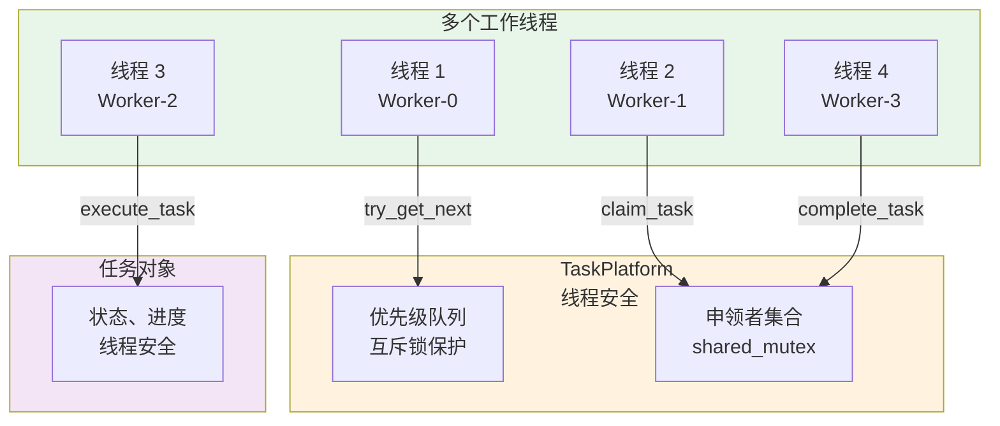
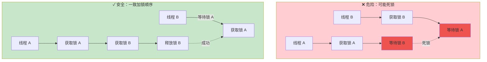
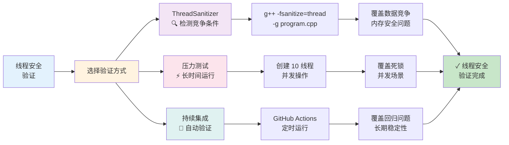
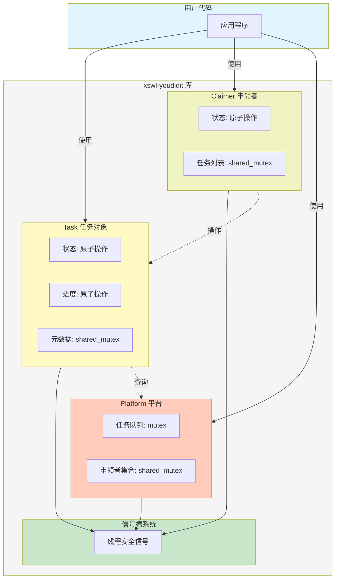

# xswl-youdidit

一个高性能的任务代理平台库，采用赏金榜游戏机制，支持多角色任务交互与实时监控。

## 📖 目录

- [📋 项目简介](#-项目简介)
- [🛠️ 技术栈](#️-技术栈)
- [✨ 核心特性](#-核心特性)
- [🚀 快速开始](#-快速开始)
- [☁️ GitHub Codespaces](#-在-codespaces-中快速开始)
- [🏗️ 项目结构](#️-项目结构)
- [📖 核心概念](#-核心概念)
- [💡 主要特性详解](#-主要特性详解)
- [🔐 线程安全设计](#-线程安全设计)
- [🔍 信号槽机制](#-信号槽机制详解)
- [📊 监控与可视化](#-监控与可视化)
- [📦 依赖库](#-依赖库)
- [📝 使用示例](#-使用示例)
- [🤝 贡献指南](#-贡献指南)
- [📄 许可证](#-许可证)

---

## 📋 项目简介

**xswl-youdidit** 是一个分布式任务处理平台，模拟真实世界的赏金榜系统。通过游戏化的任务交互机制，支持任务发布者、申领者、分派者等多角色协作，实现高效的异步任务处理与状态追踪。

### 设计理念

- **游戏化机制**：借鉴赏金榜游戏模式，使任务交互更加直观有趣
- **实时监控**：完整的日志记录和 Web 可视化工具，支持时间回放功能
- **高性能并发**：支持大规模并发任务处理和动态调度

## 🛠️ 技术栈

- **编程语言**: C++11
- **编译工具**: CMake
- **编译器**: MinGW
- **依赖库**: tl::optional、tl::expected 等第三方库

## ✨ 核心特性

### 📤 任务发布与申领
- 任务发布者可以发布任务到平台
- 支持等待任务申领结果、处理结果、状态反馈
- 申领者负责处理任务并反馈执行状态
- 支持任务分派，发布者可指定特定处理者

### ⚡ 并发与调度
- 支持任意多个任务申领者同时处理各种任务
- 支持设置和实时调整任务优先级
- 支持多角色并发交互

### 🏛️ 架构设计
- 采用信号槽机制（使用 [xswl-signals](https://github.com/Wang-Jianwei/xswl-signals.git) 库）
- 游戏化设计风格，类似真实世界的赏金榜模式
- 代码接口命名贴近赏金榜游戏角色

### 📊 监控与日志
- 记录各角色交互日志和状态到状态文件
- 提供 Web 工具实时查看系统状态
- 支持时间回放功能，如同游戏仿真界面

## 🚀 快速开始

> **📌 在 GitHub Codespaces 中？** 
> 查看 [Codespaces 用户指南](docs/ops/CODESPACES_GUIDE.md) 了解如何在云端运行和访问 Web 仪表板！

### 前置要求

- C++11 或更高版本
- CMake 3.10+
- GCC/Clang 编译器（或在 Windows 上使用 MinGW）
- Python 3（可选，用于测试结果分析）

### 构建项目

```bash
# 克隆仓库（如果还没有）
git clone https://github.com/Wang-Jianwei/xswl-youdidit.git
cd xswl-youdidit

# 初始化子模块（下载 xswl-signals）
git submodule update --init --recursive  # 初始化子模块（下载 xswl-signals）
```

### 使用构建脚本（推荐）

项目提供了便捷的构建测试脚本：

#### 快速测试（最快）
```bash
./quick_test.sh
```
快速编译并运行核心测试套件。

#### 完整构建与测试
```bash
./build_and_test.sh [选项]
```

**选项说明：**
- `--help` - 显示帮助信息
- `--clean` - 清空构建目录并重新构建
- `--unit` - 仅运行单元测试
- `--integration` - 仅运行集成测试
- `--examples` - 构建并运行示例程序
- `--all` - 运行所有测试与示例
- `-j N` - 指定并行构建数（默认为 CPU 核心数）

**示例：**
```bash
# 清空后完整构建与测试
./build_and_test.sh --clean --all

# 仅运行单元测试
./build_and_test.sh --unit

# 使用 4 个线程编译
./build_and_test.sh -j 4
```

#### 清理构建产物
```bash
# 交互式清理：
./build_and_test.sh --clean
# 非交互或 CI 环境强制清理：
FORCE_CLEAN=1 ./build_and_test.sh --clean
```

#### 详细的测试分析（Python）
```bash
python3 analyze_tests.py [构建目录]
```
运行完整测试套件并生成 JSON 格式的详细报告。

### Windows PowerShell 构建脚本

本项目同时提供了适用于 Windows 的 PowerShell 脚本（建议使用 PowerShell 7+）。脚本支持清理、构建、运行测试与示例，且为常见 Windows 场景做了兼容处理。

基本用法：

```powershell
# 查看帮助
.\build_and_test.ps1 -Help

# 清空构建目录后完整构建与测试（示例）
.\build_and_test.ps1 -Clean -All

# 仅运行单元测试
.\build_and_test.ps1 -Unit

# 仅构建并运行示例
.\build_and_test.ps1 -Examples

# 指定并行数
.\build_and_test.ps1 -J 4
```

运行示例与测试（常用操作）

- 使用脚本（推荐）：
  - 构建并运行所有示例（含 Web 示例需使用 `-ForceWeb` 或设置环境变量）：
    `.\build_and_test.ps1 -Examples -ForceWeb`
  - 构建并运行测试：
    `.\build_and_test.ps1 -Unit`

- 手动构建（使用 Visual Studio / MSVC）：
  - 打开“Developer PowerShell for VS”或相应的开发者命令提示符，然后执行：
    ```powershell
    mkdir build; cd build
    cmake .. -DCMAKE_BUILD_TYPE=Release
    cmake --build . --config Release -j 4
    ctest -C Release --output-on-failure
    ```

- 手动构建（使用 MinGW / Ninja）：
  - 在 PowerShell 中（确保 MinGW/Ninja 在 PATH）执行：
    ```powershell
    mkdir build; cd build
    cmake -G "Ninja" .. -DCMAKE_BUILD_TYPE=Release
    ninja -j 4
    ctest --output-on-failure
    ```

运行构建产物：

- 可直接运行可执行文件，例如：
  ```powershell
  .\build\examples\easy-example_basic_usage.exe
  .\build\examples\easy-example_perf_monitor.exe 8000 5 "5-5" perf_report.html 50 100000 2000 500000 "A,B,C,D,E"
  ```
- 测试可执行文件位于 `build\tests\`，也可以直接运行这些 exe 或使用 `ctest`。

编码与权限注意：
> ⚠️ **注意：** 若脚本出现乱码或解析错误，请确保 `build_and_test.ps1` 文件编码为 UTF-8 (带 BOM) 或 UTF-16 LE (Unicode)。可用 `tools/convert_encoding.ps1` 脚本安全转换编码。
> 执行脚本时，若遇到执行策略限制，可在具有管理员权限的 PowerShell 中临时设置（仅当前会话）：
> `Set-ExecutionPolicy -ExecutionPolicy RemoteSigned -Scope Process`。

### 手动构建与测试

如果您更倾向于手动操作：

```bash
# 创建构建目录
mkdir build
cd build

# 配置 CMake（启用 Web 子工程）
cmake .. -DBUILD_WEB=ON

# 如果需要构建 Web 的示例或测试（在 Windows 下默认关闭）
# cmake .. -DBUILD_WEB=ON -DBUILD_WEB_EXAMPLES=ON -DBUILD_WEB_TESTS=ON

# 指定构建类型（单配置生成器）
# cmake .. -DCMAKE_BUILD_TYPE=Release

# 编译（使用多核加速）
make -j$(nproc)

# 运行单元测试（注意：在某些 Windows 工具链下，Web 测试/示例可能默认未构建）
./tests/easy-test_types
./tests/easy-test_task
./tests/easy-test_claimer
./tests/easy-test_task_platform
# 如果已启用 Web 子工程并构建测试：
# ./tests/easy-test_web

# 运行集成测试
./tests/easy-integration_test_workflow
# 如果启用了 Web 集成测试：
# ./tests/easy-integration_test_web_api

# 运行示例
./examples/easy-example_basic_usage
./examples/easy-example_multi_claimer
# Web 示例位于 web/examples/，需启用 BUILD_WEB_EXAMPLES
# ./web/examples/easy-example_web_demo

# 或使用 CTest 运行所有测试
ctest --output-on-failure
```

注意：如果使用仓库提供的 Windows 脚本 `build_and_test.ps1`，可以如下强制构建 Web 或指定构建类型：

```powershell
# 强制构建 Web（默认在不兼容工具链上会跳过）
.\build_and_test.ps1 -ForceWeb
# 或通过环境变量
$env:FORCE_BUILD_WEB = '1'; .\build_and_test.ps1

# 指定构建类型（Debug / Release / RelWithDebInfo / MinSizeRel）
.\build_and_test.ps1 -BuildType Debug
```

**编译要求**:
- CMake 3.10+
- C++11 编译器（GCC 4.8+, Clang 3.4+, MSVC 2015+, MinGW）
- Git（用于下载 submodule）

## ☁️ 在 Codespaces 中快速开始

如果您在 GitHub Codespaces 中工作，可直接运行并访问 Web 仪表板（Dashboard）！

```bash
# 启动 Web 仪表板演示（带友好的 UI 提示）
./run_web_demo.sh

# 然后在浏览器中打开
# - 本地：http://localhost:8080
# - Codespaces：使用 Ports 视图中的端口转发链接
```

详见 [Codespaces 用户指南](docs/ops/CODESPACES_GUIDE.md)，了解：
- 📺 如何访问 Web 仪表板
- 🔌 端口转发配置
- 🐛 常见问题排除
- 📡 REST API 使用

### 基本使用流程

1. **发布任务**：任务发布者创建任务并提交到平台
2. **申领任务**：处理者查看并申领合适的任务
3. **执行处理**：申领者处理任务并反馈状态
4. **监控查看**：通过 Web 工具实时监控任务进展和系统状态

### 设计模式

采用现代 C++ 设计模式：

- **Fluent API**：链式调用，提高代码可读性
- **智能指针**：自动内存管理，避免内存泄漏
- **函数式回调**：使用 Lambda 表达式处理事件
- **Result 类型**：使用 `tl::expected` 进行优雅的错误处理

## 🏗️ 项目结构

```
xswl-youdidit/
├── include/          # 头文件
├── src/              # 源代码实现
├── tests/            # 测试代码
├── web/              # Web 监控工具
├── CMakeLists.txt    # 构建配置
└── README.md         # 本文件
```

## 📖 核心概念

简短说明：`xswl-youdidit` 的核心概念（任务模型、角色、生命周期、线程安全与信号槽语义等）已移至文档目录以保持本 README 精炼。

- 详细设计与概念说明：`docs/architecture/CONCEPTS.md`（包含状态转换图、线程安全细则与信号语义）
- 使用示例与代码片段：`docs/usage.md`
- API 参考：`docs/api/API.md`

请在相应文档中查阅实现细节、示例代码与最佳实践。
[开发者示例已移至 `docs/developer/DEVELOPER_GUIDE.md`（开发者指南）。]

有关设计示例已移至 `docs/developer/DEVELOPER_GUIDE.md`（示例与实现说明）。

### 任务定义

任务（Task）是平台的核心实体，代表需要处理的工作单元。

> 📚 **完整 API 定义请参阅 [API.md](docs/api/API.md#任务类-task)**

#### 核心属性概览

| 属性分类 | 主要属性 | 说明 |
|---------|---------|------|
| **基本信息** | `id`, `title`, `description` | 任务标识和描述 |
| **调度属性** | `priority`, `category`, `tags` | 用于任务分类和优先级调度 |
| **角色关系** | `publisher_id`, `claimer_id`, `required_role` | 发布者和申领者关系 |
| **状态追踪** | `status`, `progress` | 任务当前状态和进度 |
| **时间信息** | `created_at`, `deadline`, `completed_at` | 时间节点记录 |
| **奖励机制** | `reward_points`, `reward_type` | 赏金榜特色 |

#### 关键设计：业务逻辑携带

任务携带 `TaskHandler` 处理函数，由发布者定义具体业务逻辑：

```cpp
using TaskHandler = std::function<TaskResult(
    Task &task,              // 任务对象本身（用于更新进度等）
    const std::string &input // 输入数据（格式由用户定义）
)>;
```

**注意**：`TaskHandler` 现在直接返回 `TaskResult`；若处理失败，请返回 `TaskResult::Failure(Error(...))`，例如：

```cpp
return TaskResult::Failure(Error("处理失败原因", ErrorCode::TASK_EXECUTION_FAILED));
```

> **设计说明**：`input` 参数使用简单的 `std::string`，用户可根据需要传入文件路径、JSON 字符串、配置文本等任意格式，在 handler 内自行解析。

有关开发者/实现细节（示例代码、状态机、角色接口、Claimer API 等）已移至：

- `docs/developer/DEVELOPER_GUIDE.md`（开发者指南，包含示例与 API 摘要）
- `docs/usage.md`（使用示例）
- `docs/architecture/CONCEPTS.md`（设计细则与状态图）

请根据你的身份（使用者 / 开发者）选择合适的文档以获取详细信息。

## 💡 主要特性详解

### 多优先级调度

支持动态设置和调整任务优先级，确保高优先级任务优先处理：

- **实时调整**：可在任务处理前后调整优先级
- **公平调度**：相同优先级任务按 FIFO 处理
- **优先级范围**：支持自定义优先级数值范围

### 并发处理

- 支持多个申领者同时处理不同任务
- 线程安全的任务分配和状态同步
- 自动处理并发冲突和资源竞争

## 🔐 线程安全设计

简要说明：仓库实施细粒度锁、读写分离和原子操作以保证高并发场景的正确性。详细实现、示例与验证方法（例如 ThreadSanitizer、压力测试、加锁约定）已整理至 `docs/architecture/CONCEPTS.md`，请到该文档查阅完整细节与示例。
```

#### 2. **任务申领的原子性**

两个申领者同时申领同一个任务的并发保证：



#### 3. **进度更新的高效性**

处理中的任务频繁更新进度的优化：



| 特性 | 互斥锁 | 原子操作 |
|------|-------|--------|
| **加锁开销** | 有 🔒 | 无 ⚡ |
| **锁竞争** | 高 | 低 |
| **内存序** | 完全同步 | acq_rel 保证 |
| **频繁更新** | 低效 | 高效 ✓ |
| **高吞吐** | 受限 | 优势 |

#### 4. **读写分离的高效并发读**

Web 监控工具频繁读取、申领者实时更新的并发场景：



**并发性能对比：**

| 场景 | 互斥锁 | shared_mutex |
|------|-------|-------------|
| **读 + 读** | ❌ 互斥 | ✓ 并发 🚀 |
| **读 + 写** | ❌ 互斥 | ❌ 互斥 |
| **写 + 写** | ❌ 互斥 | ❌ 互斥 |
| **读多写少** | 低效 | 高效 |

### 线程安全的最佳实践

#### 1. **任务定义时的线程安全**



#### 2. **信号槽的线程安全使用**



#### 3. **申领者并发处理任务**



### 性能考虑

| 场景 | 同步方式 | 原因 | 性能影响 |
|------|--------|------|--------|
| 状态读取 | 原子操作 | `load()` 无需加锁 | 很小 |
| 状态修改 | 互斥锁 | 需要验证转换有效性 | 中等 |
| 进度更新 | 原子操作 | `exchange()` 频繁调用 | 很小 |
| 元数据读取 | 共享锁 | 允许多个读者 | 很小 |
| 元数据修改 | 独占锁 | 排他性写入 | 中等 |
| 任务查询 | 共享锁 | 只读操作 | 很小 |
| 任务申领 | 互斥锁 | 必须是原子操作 | 中等 |
| 优先级队列 | 互斥锁 | 堆操作需要互斥 | 中等 |

### 潜在的死锁避免



**加锁顺序约定：**
1. 总是先加 `platform_mutex`
2. 再加 `task_mutex`  
3. 最后加 `data_mutex`

### 建议的验证方式



**验证工具详解：**

| 工具 | 作用 | 检测项 | 覆盖率 |
|------|------|--------|--------|
| **ThreadSanitizer** | 动态检测 | 竞争条件、死锁 | 高 ✓ |
| **压力测试** | 长期运行 | 隐藏竞争、资源泄漏 | 中等 |
| **StaticAnalyzer** | 静态分析 | 明显问题 | 低 |
| **代码审查** | 人工检查 | 逻辑问题 | 高 |

### 线程安全总体架构



## 🔍 信号槽机制（简要）

事件驱动使用 `xswl-signals` 提供类型安全与线程安全的信号/槽机制。有关用法示例、优先级与同步/异步语义的详细说明已移至 `docs/architecture/CONCEPTS.md`，请在那里查看“信号语义”和示例章节。

### 使用模式

```cpp
// 模式 1：Lambda 连接（最常用）
task->sig_status_changed().connect([](TaskStatus status) {
    std::cout << "Task status: " << status.name() << std::endl;
});

// 模式 2：成员函数连接（自动生命周期追踪）
auto handler = std::make_shared<EventHandler>();
task->sig_completed().connect(handler, &EventHandler::on_task_complete);

// 模式 3：优先级调度
claimer->sig_progress_updated().connect([](const TaskId &id, int progress) {
    std::cout << "Progress: " << progress << "%" << std::endl;
}, 100);  // 优先级为 100

// 模式 4：单次执行
task->sig_published().connect_once([](const TaskId &id) {
    std::cout << "Task published first time" << std::endl;
});

// 模式 5：连接管理（RAII 风格）
{
    xswl::scoped_connection_t conn = task->sig_status_changed().connect([](TaskStatus status) {
        std::cout << "Inside scope" << std::endl;
    });
    
    task->set_status(TaskStatus::Processing);  // 触发信号
}  // conn 析构，自动断开连接

task->set_status(TaskStatus::Completed);  // 不会触发之前的回调

// 模式 6：批量管理（连接组）
xswl::connection_group_t conns;
conns += task->sig_status_changed().connect([](TaskStatus status) { /* ... */ });
conns += task->sig_progress_updated().connect([](int progress) { /* ... */ });

conns.disconnect_all();  // 一次性断开所有连接
```

### 信号列表

| 对象 | 信号名 | 参数 | 触发时机 |
|------|--------|------|---------|
| **Task** | `sig_status_changed()` | `TaskStatus` | 任务状态变化 |
| | `sig_progress_updated()` | `int` | 进度更新 |
| | `sig_published()` | `TaskId` | 任务发布 |
| | `sig_claimed()` | `TaskId, string` | 任务被申领 |
| | `sig_started()` | `TaskId` | 开始处理 |
| | `sig_completed()` | `TaskId, TaskResult` | 处理完成 |
| | `sig_failed()` | `TaskId, Error` | 处理失败 |
| | `sig_priority_changed()` | `int, int` | 优先级变化 (旧值, 新值) |
| **Claimer** | `sig_task_assigned()` | `shared_ptr<Task>` | 任务分派给申领者 |
| | `sig_task_started()` | `shared_ptr<Task>` | 申领者开始任务 |
| | `sig_progress_updated()` | `TaskId, int` | 任务进度更新 |
| | `sig_task_completed()` | `shared_ptr<Task>, TaskResult` | 任务完成 |
| | `sig_task_failed()` | `shared_ptr<Task>, Error` | 任务失败 |
| | `sig_task_abandoned()` | `shared_ptr<Task>, string` | 任务放弃 |
| | `sig_status_changed()` | `ClaimerState` | 申领者状态变化（传递 `ClaimerState`，包含 online/accepting_new_tasks/active/max_concurrent） |
| **TaskPlatform** | `sig_task_published()` | `shared_ptr<Task>` | 任务发布到平台 |
| | `sig_task_claimed()` | `shared_ptr<Task>` | 任务被申领 |
| | `sig_task_started()` | `shared_ptr<Task>` | 任务开始处理 |
| | `sig_task_completed()` | `shared_ptr<Task>, TaskResult` | 任务完成 |
| | `sig_task_failed()` | `shared_ptr<Task>, string` | 任务失败 |
| | `sig_task_cancelled()` | `shared_ptr<Task>` | 任务被取消 |
| | `sig_claimer_registered()` | `shared_ptr<Claimer>` | 申领者注册 |
| | `sig_claimer_unregistered()` | `string` | 申领者注销 |

> **注意**：表格中 `shared_ptr<T>` 是 `const std::shared_ptr<T>&` 的简写。
>
> **信号使用建议（生命周期与安全）**：
> - **优先使用** `connect(const std::shared_ptr<Obj>&, &Obj::member)`，库会使用弱引用自动跳过已销毁对象。
> - 避免将裸指针或对局部变量的引用直接传给 `connect(...)`，除非你能**保证**对象在信号可能发射期间始终存活。
> - 对于短期连接，使用 `xswl::scoped_connection_t` 或保存 `connection_t` 并在析构时 `disconnect()` 来自动管理生命周期。
> - 示例 `examples/signals_usage.cpp` 已更新为推荐的 `shared_ptr` 模式以示范安全用法。

## 🔍 监控与可视化

xswl-youdidit 提供完整的 Web 监控系统，支持实时仪表板、事件日志、时间回放和性能分析。

> **详细文档**：
> - [文档总览](docs/README.md) - 仓库文档索引与快速导航（中文）
> - [Web 监控系统设计文档](docs/web/WEB_MONITORING.md) - 架构设计、部署模式、跨进程通信
> - [Web API 文档](docs/web/WEB_API.md) - C++ API 和 HTTP REST API 完整参考

### 核心功能

| 功能 | 说明 |
|------|------|
| **实时仪表板** | Web UI 展示任务状态、申领者状态、系统指标 |
| **事件日志** | 记录所有系统事件，支持查询和导出 |
| **时间回放** | 查看任意时刻的系统状态（Time Travel Debugging） |
| **性能分析** | 任务处理时间、申领者效率、系统吞吐量分析 |
| **数据导出** | JSON、CSV 格式导出，支持生成报告 |

### 解耦设计

Web 监控系统与核心任务调度完全解耦：

```
┌─────────────────┐       ┌─────────────────┐
│  TaskPlatform   │──────▶│  WebDashboard   │  (可选组件)
│  (核心调度)      │       │  (监控可视化)    │
└─────────────────┘       └─────────────────┘
```

- **按需启用**：不需要监控时零开销
- **故障隔离**：监控崩溃不影响核心业务
- **灵活部署**：支持同进程、独立进程、远程监控

### 快速开始

```cpp
// 创建平台
auto platform = std::make_shared<TaskPlatform>();

// 创建独立的 Web 仪表板
auto dashboard = std::make_shared<WebDashboard>(platform.get());
dashboard->set_update_interval(1000)
         ->set_max_event_history(10000)
         ->start_server(8080);

// 访问 http://localhost:8080 查看仪表板
std::cout << "Dashboard: http://localhost:8080" << std::endl;

// 获取实时指标
auto metrics = dashboard->get_metrics();
std::cout << "完成率: " << metrics.task_completion_rate * 100 << "%" << std::endl;

// 时间回放
auto replay = dashboard->get_time_replay();
auto snapshot = replay->get_snapshot_at(Timestamp::now() - std::chrono::minutes(30));
```

### 部署模式

| 模式 | 说明 | 适用场景 |
|------|------|----------|
| **同进程** | Dashboard 与 Platform 在同一进程 | 开发环境、小型部署 |
| **独立进程** | Dashboard 作为独立监控服务 | 生产环境、故障隔离 |
| **集中监控** | 一个 Dashboard 监控多个 Platform | 分布式部署、统一运维 |

> 详细的部署架构和跨进程通信设计请参阅 [Web 监控系统设计文档](docs/web/WEB_MONITORING.md)

## 📦 依赖库

- **tl::optional** - 可选值处理，支持现代 C++ 风格的可选类型
- **tl::expected** - 优雅的错误处理，提供 Result 类型语义
- **xswl-signals** - 信号槽机制，实现类型安全的事件系统

**实现细节与所用 C++ 特性**：开发者相关的实现细节（包括常用的 C++ 特性、noexcept/Pimpl 约定等）已移入 `docs/developer/DEVELOPER_GUIDE.md`，请前往查阅更详尽的说明与建议。

## 📝 使用示例（简要）

常见示例与可复制代码已移至 `docs/usage.md`，并在 `examples/` 目录附带演示程序（例如 `examples/web_demo.cpp`、`examples/basic_usage.cpp` 等）。

- 详见：`docs/usage.md`（完整示例）
- 示例目录：`examples/`

---

**© 2026 xswl-youdidit Project** | **MIT License**

## 🤝 贡献指南

欢迎提交 Issue 和 Pull Request！

1. Fork 本仓库
2. 创建特性分支 (`git checkout -b feature/AmazingFeature`)
3. 提交更改 (`git commit -m 'Add some AmazingFeature'`)
4. 推送到分支 (`git push origin feature/AmazingFeature`)
5. 开启 Pull Request

## 📄 许可证

本项目采用 MIT 许可证，详见 LICENSE 文件。

---

**开发者**: [Wang-Jianwei](https://github.com/Wang-Jianwei)

**最后更新**: 2026-01-27