# xswl-youdidit

一个高性能的任务代理平台库，采用赏金榜游戏机制，支持多角色任务交互与实时监控。

## 📖 目录

- [📋 项目简介](#-项目简介)
- [🛠️ 技术栈](#️-技术栈)
- [✨ 核心特性](#-核心特性)
- [🚀 快速开始](#-快速开始)
- [☁️ GitHub Codespaces](#-在-codespaces-中快速开始)
- [🏗️ 项目结构](#️-项目结构)
- [📖 核心概念](#-核心概念)
- [💡 主要特性详解](#-主要特性详解)
- [🔐 线程安全设计](#-线程安全设计)
- [🔍 信号槽机制](#-信号槽机制详解)
- [📊 监控与可视化](#-监控与可视化)
- [📦 依赖库](#-依赖库)
- [📝 使用示例](#-使用示例)
- [🤝 贡献指南](#-贡献指南)
- [📄 许可证](#-许可证)

---

## 📋 项目简介

**xswl-youdidit** 是一个任务分布式处理平台，模拟真实世界的赏金榜系统。通过游戏化的任务交互机制，支持任务发布者、申领者、分派者等多角色协作，实现高效的异步任务处理与状态追踪。

### 设计理念

- **游戏化机制**：借鉴赏金榜游戏模式，使任务交互更加直观有趣
- **实时监控**：完整的日志记录和 Web 可视化工具，支持时间回放功能
- **高性能并发**：支持大规模并发任务处理和动态调度

## 🛠️ 技术栈

- **编程语言**: C++11
- **编译工具**: CMake
- **编译器**: MinGW
- **依赖库**: tl::optional、tl::expected 等第三方库

## ✨ 核心特性

### 📤 任务发布与申领
- 任务发布者可以发布任务到平台
- 支持等待任务申领结果、处理结果、状态反馈
- 申领者负责处理任务并反馈执行状态
- 支持任务分派，发布者可指定特定处理者

### ⚡ 并发与调度
- 支持任意多个任务申领者同时处理各种任务
- 支持设置和实时调整任务优先级
- 支持多角色并发交互

### 🏛️ 架构设计
- 采用信号槽机制（使用 [xswl-signals](https://github.com/Wang-Jianwei/xswl-signals.git) 库）
- 游戏化设计风格，类似真实世界的赏金榜模式
- 代码接口命名贴近赏金榜游戏角色

### 📊 监控与日志
- 记录各角色交互日志和状态到状态文件
- 提供 Web 工具实时查看系统状态
- 支持时间回放功能，如同游戏仿真界面

## 🚀 快速开始

> **📌 在 GitHub Codespaces 中？** 
> 查看 [Codespaces 用户指南](CODESPACES_GUIDE.md) 了解如何在云端运行和访问 Web 仪表板！

### 前置要求

- C++11 或更高版本
- CMake 3.10+
- GCC/Clang 编译器（或 MinGW on Windows）
- Python 3（可选，用于测试结果分析）

### 构建项目

```bash
# 克隆仓库（如果还没有）
git clone https://github.com/Wang-Jianwei/xswl-youdidit.git
cd xswl-youdidit

# 初始化 git submodule（下载 xswl-signals）
git submodule update --init --recursive
```

### 使用构建脚本（推荐）

项目提供了便捷的构建测试脚本：

#### 快速测试（最快）
```bash
./quick_test.sh
```
快速编译并运行核心测试套件。

#### 完整构建与测试
```bash
./build_and_test.sh [选项]
```

**选项说明：**
- `--help` - 显示帮助信息
- `--clean` - 清空构建目录并重新构建
- `--unit` - 仅运行单元测试
- `--integration` - 仅运行集成测试
- `--examples` - 构建并运行示例程序
- `--all` - 运行所有测试与示例
- `-j N` - 指定并行构建数（默认为 CPU 核心数）

**示例：**
```bash
# 清空后完整构建与测试
./build_and_test.sh --clean --all

# 仅运行单元测试
./build_and_test.sh --unit

# 使用 4 个线程编译
./build_and_test.sh -j 4
```

#### 清理构建产物
```bash
./clean.sh
```

#### 详细的测试分析（Python）
```bash
python3 analyze_tests.py [构建目录]
```
运行完整测试套件并生成 JSON 格式的详细报告。

### 手动构建与测试

如果您更倾向于手动操作：

```bash
# 创建构建目录
mkdir build
cd build

# 配置 CMake
cmake ..

# 编译（使用多核加速）
make -j$(nproc)

# 运行单元测试
./tests/test_types
./tests/test_task
./tests/test_claimer
./tests/test_task_platform
./tests/test_web

# 运行集成测试
./tests/integration_test_workflow
./tests/integration_test_web_api

# 运行示例
./examples/example_basic_usage
./examples/example_multi_claimer
./examples/example_web_monitoring

# 或使用 CTest 运行所有测试
ctest --output-on-failure
```

**编译要求**:
- CMake 3.10+
- C++11 编译器（GCC 4.8+, Clang 3.4+, MSVC 2015+, MinGW）
- Git（用于下载 submodule）

## ☁️ 在 Codespaces 中快速开始

如果您在 GitHub Codespaces 中工作，可以直接运行 Web 仪表板！

```bash
# 启动 Web 仪表板演示（带友好的 UI 提示）
./run_web_demo.sh

# 然后在浏览器中打开
# - 本地：http://localhost:8080
# - Codespaces：使用 Ports 视图中的端口转发链接
```

详见 [Codespaces 用户指南](CODESPACES_GUIDE.md)，了解：
- 📺 如何访问 Web 仪表板
- 🔌 端口转发配置
- 🐛 常见问题排除
- 📡 REST API 使用

### 基本使用流程

1. **发布任务**：任务发布者创建任务并提交到平台
2. **申领任务**：处理者查看并申领合适的任务
3. **执行处理**：申领者处理任务并反馈状态
4. **监控查看**：通过 Web 工具实时监控任务进展和系统状态

### 设计模式

采用现代 C++ 设计模式：

- **Fluent API**：链式调用，提高代码可读性
- **智能指针**：自动内存管理，避免内存泄漏
- **函数式回调**：使用 Lambda 表达式处理事件
- **Result 类型**：使用 `tl::expected` 进行优雅的错误处理

## 🏗️ 项目结构

```
xswl-youdidit/
├── include/          # 头文件
├── src/              # 源代码实现
├── tests/            # 测试代码
├── web/              # Web 监控工具
├── CMakeLists.txt    # 构建配置
└── README.md         # 本文件
```

## 📖 核心概念

### 设计原则：职责分离

**关键设计理念**：任务的业务逻辑由任务本身携带，申领者只负责执行。

```
┌─────────────────────────────────────────────────────────┐
│                    职责分离原则                         │
├─────────────────────────────────────────────────────────┤
│                                                         │
│  发布者（Publisher）                                    │
│  ├─ 定义任务要做什么（业务逻辑）                         │
│  ├─ 设置任务优先级和元数据                              │
│  └─ 指定所需的执行者角色/技能                           │
│                                                         │
│  任务（Task）                                           │
│  ├─ 携带业务处理函数（handler）                          │
│  ├─ 维护状态和进度信息                                  │
│  └─ 触发生命周期事件信号                                │
│                                                         │
│  申领者（Claimer）                                      │
│  ├─ 申领符合自己能力的任务                              │
│  ├─ 执行任务定义的业务逻辑                              │
│  └─ 反馈执行状态和结果                                  │
│                                                         │
└─────────────────────────────────────────────────────────┘
```

#### 为什么这样设计？

1. **单一职责**：申领者不需要知道"做什么"，只需要知道"怎么执行"
2. **可复用性**：同一个申领者可以处理各种不同的任务
3. **解耦合**：任务逻辑变化不影响申领者实现
4. **类型安全**：业务逻辑通过 `std::function` 封装，编译期类型检查

#### 对比错误设计

❌ **错误设计**：申领者决定业务逻辑
```cpp
// 不好的设计：申领者需要知道具体做什么
class DataProcessorClaimer : public Claimer {
    void process_task(const Task &task) override {
        // 申领者自己决定如何处理任务 - 这是错的！
        load_data(task.metadata["file"]);
        process_data();
        save_result();
    }
};
```

✅ **正确设计**：任务携带业务逻辑
```cpp
// 好的设计：任务本身定义业务逻辑
auto task = platform->task_builder()
    .handler([](Task &task, const auto &input) {
        // 发布者在这里定义任务要做什么
        load_data(input.at("file"));
        process_data();
        save_result();
        return TaskResult{};
    })
    .build();

// 申领者只负责执行
claimer->execute_task(task.id(), "/data/input.csv");
```

### 任务定义

任务（Task）是平台的核心实体，代表需要处理的工作单元。

> 📚 **完整 API 定义请参阅 [API.md](API.md#任务类-task)**

#### 核心属性概览

| 属性分类 | 主要属性 | 说明 |
|---------|---------|------|
| **基本信息** | `id`, `title`, `description` | 任务标识和描述 |
| **调度属性** | `priority`, `category`, `tags` | 用于任务分类和优先级调度 |
| **角色关系** | `publisher_id`, `claimer_id`, `required_role` | 发布者和申领者关系 |
| **状态追踪** | `status`, `progress` | 任务当前状态和进度 |
| **时间信息** | `created_at`, `deadline`, `completed_at` | 时间节点记录 |
| **奖励机制** | `reward_points`, `reward_type` | 赏金榜特色 |

#### 关键设计：业务逻辑携带

任务携带 `TaskHandler` 处理函数，由发布者定义具体业务逻辑：

```cpp
using TaskHandler = std::function<tl::expected<TaskResult, std::string>(
    Task &task,              // 任务对象本身（用于更新进度等）
    const std::string &input // 输入数据（格式由用户定义）
)>;
```

> **设计说明**：`input` 参数使用简单的 `std::string`，用户可仠据需要传入文件路径、JSON 字符串、配置文本等任意格式，在 handler 内自行解析。

#### 任务业务逻辑定义示例

```cpp
// 示例 1：直接使用文件路径
auto task1 = platform->task_builder()
    .title("数据处理任务")
    .priority(5)
    .handler([](Task &task, const std::string &input) -> tl::expected<TaskResult, std::string> {
        // input 直接是文件路径
        task.set_progress(10);
        auto data = load_file(input);
        
        task.set_progress(50);
        auto result = process_data(data);
        
        task.set_progress(100);
        return TaskResult{true, "处理完成"};
    })
    .build();

// 调用时
claimer->execute_task(task1->id(), "/data/input.csv");

// 示例 2：使用 JSON 字符串传递复杂参数
auto task2 = platform->task_builder()
    .title("复杂分析任务")
    .handler([](Task &task, const std::string &input) -> tl::expected<TaskResult, std::string> {
        // 按需解析 JSON
        auto config = nlohmann::json::parse(input);
        std::string file_path = config["file_path"];
        int batch_size = config.value("batch_size", 100);
        
        // ... 业务逻辑
        return TaskResult{true, "分析完成"};
    })
    .build();

// 调用时传入 JSON 字符串
claimer->execute_task(task2->id(), R"({"file_path": "/data/input.csv", "batch_size": 50})");
```

#### 任务状态（TaskStatus）

任务在生命周期中会经历以下状态：

| 状态 | 枚举值 | 描述 | 可转换到 |
|------|--------|------|----------|
| **待发布** | `Draft` | 任务已创建，尚未发布到平台 | Published |
| **已发布** | `Published` | 任务已发布，等待申领 | Claimed, Cancelled |
| **已申领** | `Claimed` | 已被处理者申领，准备开始 | Processing, Abandoned |
| **处理中** | `Processing` | 正在执行处理 | Paused, Completed, Failed |
| **暂停** | `Paused` | 暂时停止处理 | Processing, Abandoned |
| **已完成** | `Completed` | 任务成功完成 | - |
| **失败** | `Failed` | 任务处理失败 | Published, Abandoned |
| **已取消** | `Cancelled` | 发布者取消任务 | - |
| **已放弃** | `Abandoned` | 申领者放弃任务 | Published |

#### 状态转换图

```
                              ┌──────────┐
                              │  Draft   │
                              └────┬─────┘
                                   │
                                   ↓
         ┌────────────────── Published ←──────────────┐
         │                        │                   │
         ↓                        ↓                   │
    Cancelled                 Claimed ─────→ Abandoned ─┘
                                  │                   ↑
                                  ↓                   │
    ┌────────────────────── Processing ───────────────┤
    │                             │                   │
    ↓                             ↓                   │
 Paused ─────────────────→ Completed / Failed ────────┘
    │                                       │
    └───────────────→ Processing ←──────────┘
```

**说明**：
- `Paused` 可以恢复到 `Processing`
- `Failed` 可以重新发布回 `Published` 或标记为 `Abandoned`
- `Abandoned` 任务可重新发布回 `Published`

### 角色定义

| 角色 | 职责 | 功能 |
|------|------|------|
| **发布者** | 创建任务 | 发布、分派、监控任务 |
| **申领者** | 处理任务 | 申领、执行、反馈状态 |
| **分派者** | 指定处理者 | 精准分配任务给特定申领者 |

### 申领者定义（Claimer）

申领者（Claimer）是任务的实际执行者，负责从平台申领并处理任务。

> 📚 **完整 API 定义请参阅 [API.md](API.md#申领者类-claimer)**

#### 核心属性概览

| 属性分类 | 主要属性 | 说明 |
|---------|---------|------|
| **基本信息** | `id`, `name`, `role` | 申领者标识 |
| **能力信息** | `skills`, `categories`, `max_concurrent_tasks` | 处理能力 |
| **状态信息** | `status`, `active_task_count` | 当前状态 |
| **统计信息** | `total_completed`, `success_rate`, `reputation_points` | 历史统计 |

#### 申领者状态（ClaimerStatus）

| 状态 | 枚举值 | 描述 |
|------|--------|------|
| **空闲** | `Idle` | 可以申领新任务 |
| **忙碌** | `Busy` | 已达到最大并发任务数 |
| **离线** | `Offline` | 暂时不可用 |
| **暂停** | `Paused` | 暂停接受新任务 |

#### 核心方法概览

```cpp
class Claimer {
public:
    // 任务申领 - 四种方式
    tl::expected<std::shared_ptr<Task>, Error> claim_task(const TaskId &task_id);      // 指定申领
    tl::expected<std::shared_ptr<Task>, Error> claim_next_task();                       // 队列申领
    tl::expected<std::shared_ptr<Task>, Error> claim_matching_task();                   // 匹配申领
    std::vector<std::shared_ptr<Task>> claim_tasks_to_capacity();                       // 批量申领
    
    // 任务执行
    tl::expected<void, Error> execute_task(const TaskId &task_id, const std::string &input = "");
    
    // 状态管理
    Claimer &set_status(ClaimerStatus status);
    bool can_claim_more() const noexcept;
};
```

#### 使用示例

```cpp
// 创建申领者
auto claimer = std::make_shared<Claimer>("worker-001", "Alice");
claimer->set_role("DataProcessor")
       .add_skill("data_analysis")
       .add_skill("machine_learning")
       .set_max_concurrent(5);

// 监听任务分配事件
claimer->sig_task_assigned().connect([](const std::shared_ptr<Task> &task) {
    std::cout << "New task assigned: " << task->title() << std::endl;
});

// 申领并执行任务
auto result = claimer->claim_next_task();
if (result) {
    auto task = result.value();
    claimer->execute_task(task->id(), "/data/input.csv");
}
```

### 任务生命周期

1. **待发布** → 任务创建初始状态
2. **已发布** → 任务进入平台，等待申领
3. **已申领** → 申领者开始处理
4. **处理中** → 任务执行阶段，定期反馈状态
5. **已完成** → 任务处理完成，反馈最终结果

### 交互流程图

以下泳道图展示了任务从发布到完成的完整交互流程：

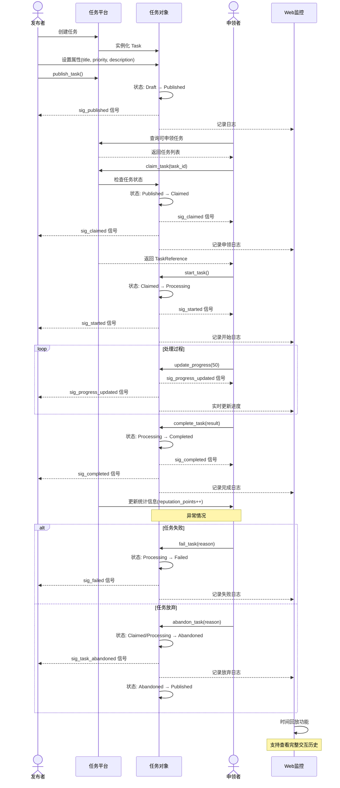

**流程说明**：

1. **任务发布阶段**：发布者创建任务并发布到平台，触发 `sig_published` 信号
2. **任务申领阶段**：申领者查询并申领任务，触发 `sig_claimed` 信号通知发布者和申领者
3. **任务处理阶段**：申领者开始处理并定期更新进度，通过 `sig_progress_updated` 实时反馈
4. **任务完成阶段**：成功完成触发 `sig_completed` 信号，系统更新申领者声望值
5. **异常处理**：支持任务失败或放弃，放弃后任务重新回到已发布状态等待其他申领者
6. **Web监控**：全程记录日志，支持时间回放查看完整交互历史

*注：图中虚线箭头(`-->>`)表示信号槽的异步通知，实线箭头(`->>`)表示直接方法调用*

## 💡 主要特性详解

### 多优先级调度

支持动态设置和调整任务优先级，确保高优先级任务优先处理：

- **实时调整**：可在任务处理前后调整优先级
- **公平调度**：相同优先级任务按 FIFO 处理
- **优先级范围**：支持自定义优先级数值范围

### 并发处理

- 支持多个申领者同时处理不同任务
- 线程安全的任务分配和状态同步
- 自动处理并发冲突和资源竞争

## 🔐 线程安全设计

### 核心原则

xswl-youdidit 设计为**完全线程安全**的库，支持多线程环境下的无锁并发访问。采用以下设计原则：

1. **细粒度锁定**：使用最小粒度的锁来保护共享数据，降低锁竞争
2. **读写分离**：关键数据结构使用 `std::shared_mutex` 允许并发读取
3. **原子操作**：针对简单数据类型优先使用原子操作避免锁开销
4. **信号安全**：信号槽机制本身是线程安全的，可跨线程使用

### 保护机制详解

#### 任务（Task）线程安全

```cpp
class Task {
private:
    // 保护状态和进度的读写锁
    mutable std::shared_mutex state_mutex_;
    
    // 保护元数据和结果的互斥锁
    mutable std::mutex data_mutex_;
    
    // 原子操作的简单属性
    std::atomic<int> progress_{0};           // 原子进度更新
    std::atomic<TaskStatus> status_;         // 原子状态
    
public:
    // 线程安全的读取方法
    TaskStatus status() const noexcept {
        // 直接读取原子变量，无需加锁
        return status_.load(std::memory_order_acquire);
    }
    
    // 线程安全的写入方法
    Task &set_status(TaskStatus new_status) {
        // 使用互斥锁保护状态转换逻辑
        {
            std::unique_lock<std::mutex> lock(state_mutex_);
            
            // 验证状态转换有效性
            if (!is_valid_transition(status_, new_status)) {
                throw std::invalid_argument("Invalid status transition");
            }
            
            auto old_status = status_.load();
            status_.store(new_status, std::memory_order_release);
            
            // 触发信号（在锁内进行以保证顺序性）
            sig_status_changed_(new_status);
        }
        
        return *this;
    }
    
    // 线程安全的进度更新
    Task &set_progress(int progress) {
        if (progress < 0 || progress > 100) {
            throw std::invalid_argument("Progress must be between 0 and 100");
        }
        
        // 原子操作，无需显式加锁
        int old_progress = progress_.exchange(progress, std::memory_order_acq_rel);
        
        // 只在进度变化时触发信号
        if (old_progress != progress) {
            sig_progress_updated_(progress);
        }
        
        return *this;
    }
    
    // 线程安全的元数据访问
    std::string get_metadata(const std::string &key) const {
        std::shared_lock<std::shared_mutex> lock(data_mutex_);
        auto it = metadata.find(key);
        if (it != metadata.end()) {
            return it->second;
        }
        return "";
    }
    
    // 批量元数据读取（使用共享锁允许并发读）
    std::map<std::string, std::string> get_all_metadata() const {
        std::shared_lock<std::shared_mutex> lock(data_mutex_);
        return metadata;  // 返回副本
    }
    
    // 元数据更新
    Task &set_metadata(const std::string &key, const std::string &value) {
        {
            std::unique_lock<std::shared_mutex> lock(data_mutex_);
            metadata[key] = value;
        }
        return *this;
    }
};
```

#### 申领者（Claimer）线程安全

```cpp
class Claimer {
private:
    // 保护申领者状态的读写锁
    mutable std::shared_mutex claimer_state_mutex_;
    
    // 保护任务列表的互斥锁
    mutable std::shared_mutex tasks_mutex_;
    
    // 原子操作的简单属性
    std::atomic<ClaimerStatus> status_{ClaimerStatus::Idle};
    std::atomic<int> active_task_count_{0};
    
public:
    // 线程安全的任务申领
    tl::expected<TaskReference, Error> claim_task(const TaskId &task_id) {
        std::unique_lock<std::shared_mutex> lock(tasks_mutex_);
        
        // 检查当前任务数是否超限
        if (active_task_count_.load() >= max_concurrent_tasks_) {
            status_.store(ClaimerStatus::Busy);
            return tl::unexpected(Error("Too many active tasks"));
        }
        
        // 添加到已申领任务列表
        claimed_tasks_.push_back(task_id);
        active_task_count_.fetch_add(1, std::memory_order_release);
        
        // 触发信号
        sig_task_assigned_(task_id);
        
        return TaskReference(task_id);
    }
    
    // 线程安全的获取活跃任务列表
    std::vector<TaskId> get_active_tasks() const {
        std::shared_lock<std::shared_mutex> lock(tasks_mutex_);
        return claimed_tasks_;  // 返回副本
    }
    
    // 线程安全的任务完成（原子更新计数）
    tl::expected<void, Error> complete_task(const TaskId &task_id) {
        {
            std::unique_lock<std::shared_mutex> lock(tasks_mutex_);
            // 从列表中移除
            auto it = std::find(claimed_tasks_.begin(), claimed_tasks_.end(), task_id);
            if (it != claimed_tasks_.end()) {
                claimed_tasks_.erase(it);
            }
        }
        
        // 更新原子计数
        active_task_count_.fetch_sub(1, std::memory_order_release);
        
        // 更新成功率统计
        {
            std::unique_lock<std::mutex> stats_lock(statistics_mutex_);
            total_completed_++;
        }
        
        return {};
    }
};
```

#### 任务平台（TaskPlatform）线程安全

```cpp
class TaskPlatform {
private:
    // 保护任务集合的读写锁
    mutable std::shared_mutex tasks_pool_mutex_;
    
    // 保护申领者集合的读写锁
    mutable std::shared_mutex claimers_mutex_;
    
    // 任务队列使用线程安全的容器
    struct TaskQueue {
        std::priority_queue<Task, std::vector<Task>, TaskComparator> queue;
        mutable std::mutex queue_mutex;
        
        // 线程安全的入队操作
        void enqueue(const Task &task) {
            std::unique_lock<std::mutex> lock(queue_mutex);
            queue.push(task);
            // 通知等待的消费者
            cv_.notify_one();
        }
        
        // 线程安全的出队操作
        tl::expected<Task, Error> try_dequeue() {
            std::unique_lock<std::mutex> lock(queue_mutex);
            if (queue.empty()) {
                return tl::unexpected(Error("Queue is empty"));
            }
            auto task = queue.top();
            queue.pop();
            return task;
        }
        
    private:
        std::condition_variable cv_;
    };
    
    TaskQueue task_queue_;
    std::unordered_map<TaskId, std::shared_ptr<Task>> all_tasks_;
    std::unordered_map<std::string, std::shared_ptr<Claimer>> claimers_;
    
public:
    // 线程安全的任务发布
    TaskId publish_task(const std::shared_ptr<Task> &task) {
        {
            std::unique_lock<std::shared_mutex> lock(tasks_pool_mutex_);
            all_tasks_[task->id()] = task;
        }
        
        task_queue_.enqueue(*task);
        sig_task_published_(*task);
        
        return task->id();
    }
    
    // 线程安全的任务查询
    std::shared_ptr<Task> get_task(const TaskId &task_id) const {
        std::shared_lock<std::shared_mutex> lock(tasks_pool_mutex_);
        auto it = all_tasks_.find(task_id);
        if (it != all_tasks_.end()) {
            return it->second;
        }
        return nullptr;
    }
    
    // 线程安全的申领者注册
    void register_claimer(const std::shared_ptr<Claimer> &claimer) {
        std::unique_lock<std::shared_mutex> lock(claimers_mutex_);
        claimers_[claimer->id()] = claimer;
    }
};
```

### 并发场景保证

#### 1. **任务状态的线程安全转换**

多个线程同时修改同一任务状态时的并发保证：

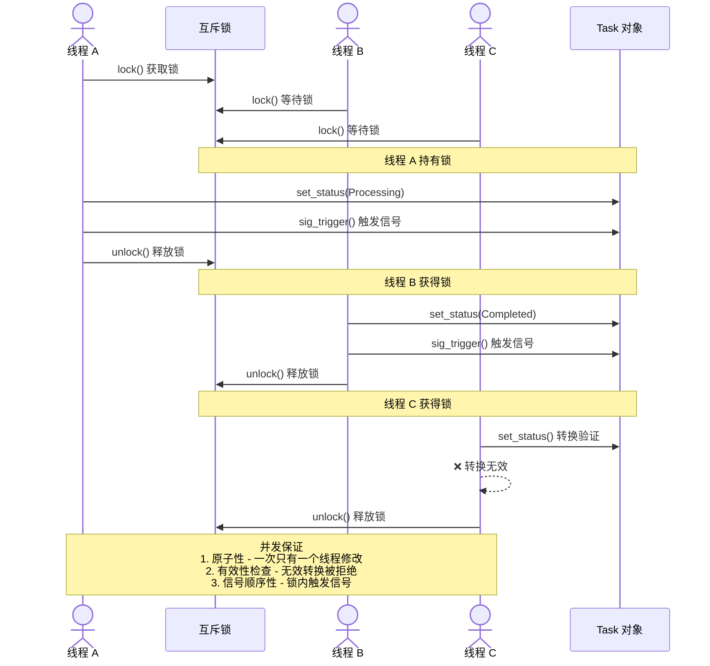

#### 2. **任务申领的原子性**

两个申领者同时申领同一个任务的并发保证：

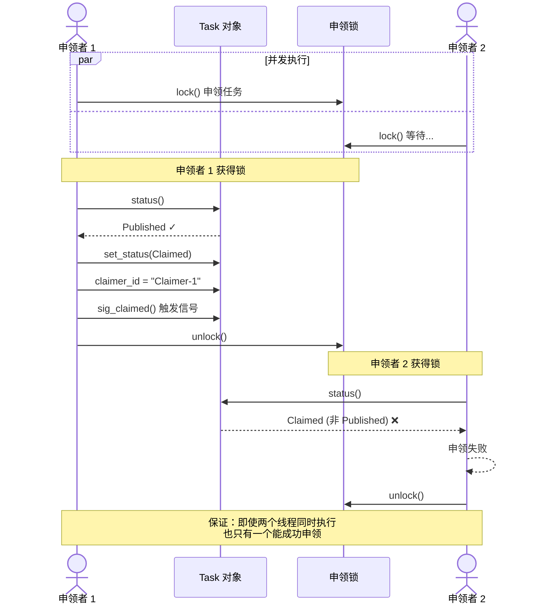

#### 3. **进度更新的高效性**

处理中的任务频繁更新进度的优化：

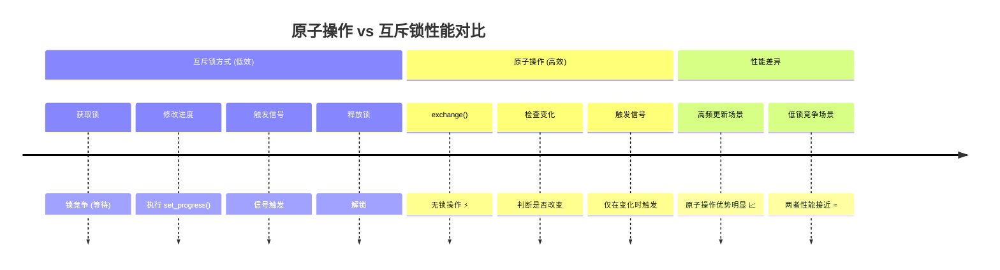

| 特性 | 互斥锁 | 原子操作 |
|------|-------|--------|
| **加锁开销** | 有 🔒 | 无 ⚡ |
| **锁竞争** | 高 | 低 |
| **内存序** | 完全同步 | acq_rel 保证 |
| **频繁更新** | 低效 | 高效 ✓ |
| **高吞吐** | 受限 | 优势 |

#### 4. **读写分离的高效并发读**

Web 监控工具频繁读取、申领者实时更新的并发场景：

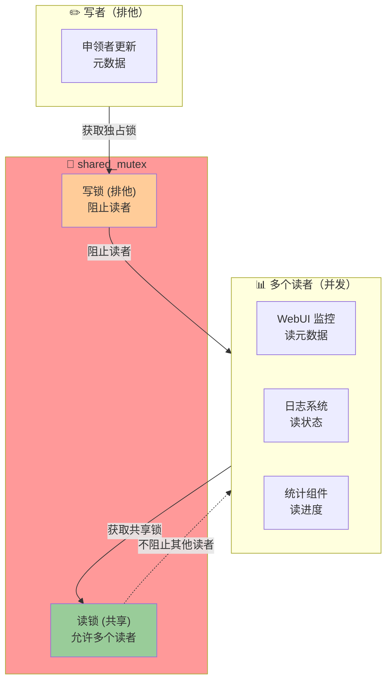

**并发性能对比：**

| 场景 | 互斥锁 | shared_mutex |
|------|-------|-------------|
| **读 + 读** | ❌ 互斥 | ✓ 并发 🚀 |
| **读 + 写** | ❌ 互斥 | ❌ 互斥 |
| **写 + 写** | ❌ 互斥 | ❌ 互斥 |
| **读多写少** | 低效 | 高效 |

### 线程安全的最佳实践

#### 1. **任务定义时的线程安全**

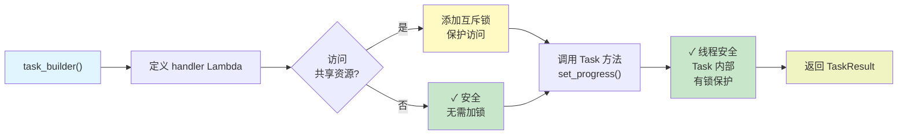

#### 2. **信号槽的线程安全使用**

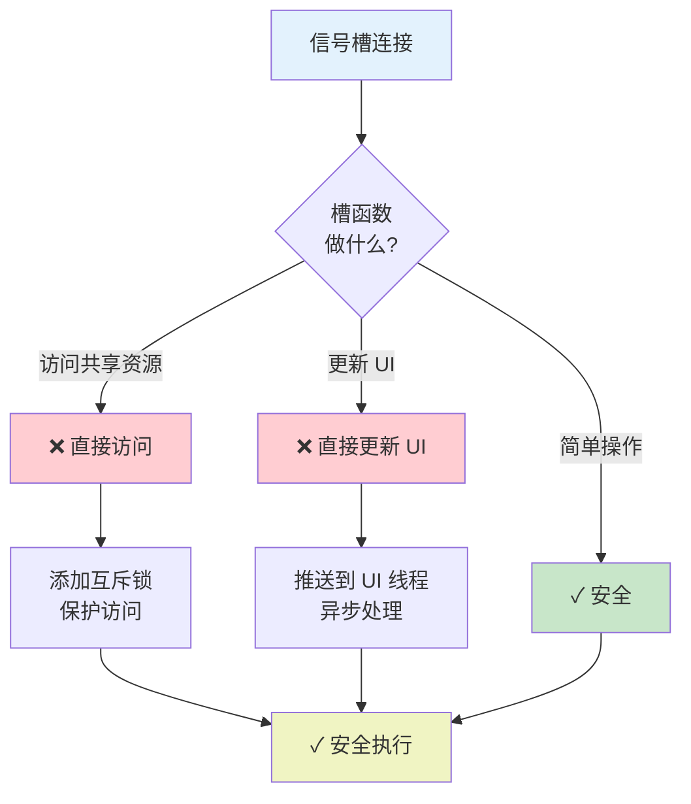

#### 3. **申领者并发处理任务**

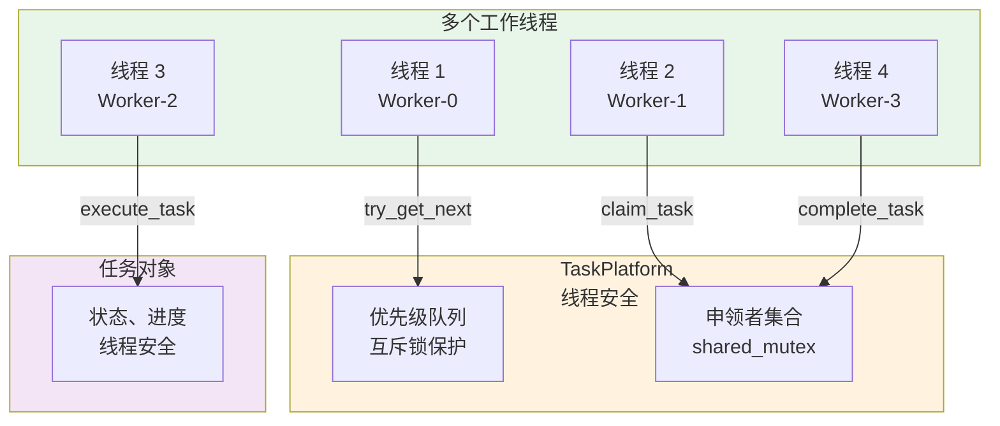

### 性能考虑

| 场景 | 同步方式 | 原因 | 性能影响 |
|------|--------|------|--------|
| 状态读取 | 原子操作 | `load()` 无需加锁 | 很小 |
| 状态修改 | 互斥锁 | 需要验证转换有效性 | 中等 |
| 进度更新 | 原子操作 | `exchange()` 频繁调用 | 很小 |
| 元数据读取 | 共享锁 | 允许多个读者 | 很小 |
| 元数据修改 | 独占锁 | 排他性写入 | 中等 |
| 任务查询 | 共享锁 | 只读操作 | 很小 |
| 任务申领 | 互斥锁 | 必须是原子操作 | 中等 |
| 优先级队列 | 互斥锁 | 堆操作需要互斥 | 中等 |

### 潜在的死锁避免

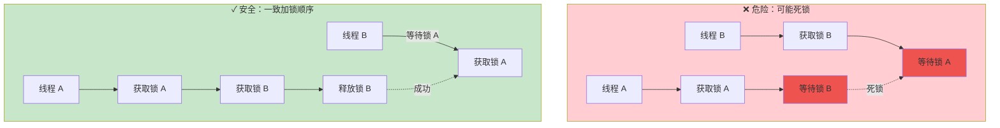

**加锁顺序约定：**
1. 总是先加 `platform_mutex`
2. 再加 `task_mutex`  
3. 最后加 `data_mutex`

### 建议的验证方式

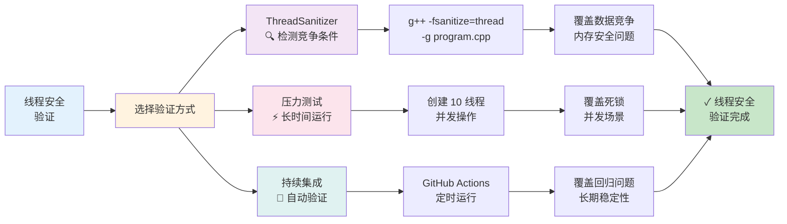

**验证工具详解：**

| 工具 | 作用 | 检测项 | 覆盖率 |
|------|------|--------|--------|
| **ThreadSanitizer** | 动态检测 | 竞争条件、死锁 | 高 ✓ |
| **压力测试** | 长期运行 | 隐藏竞争、资源泄漏 | 中等 |
| **StaticAnalyzer** | 静态分析 | 明显问题 | 低 |
| **代码审查** | 人工检查 | 逻辑问题 | 高 |

### 线程安全总体架构

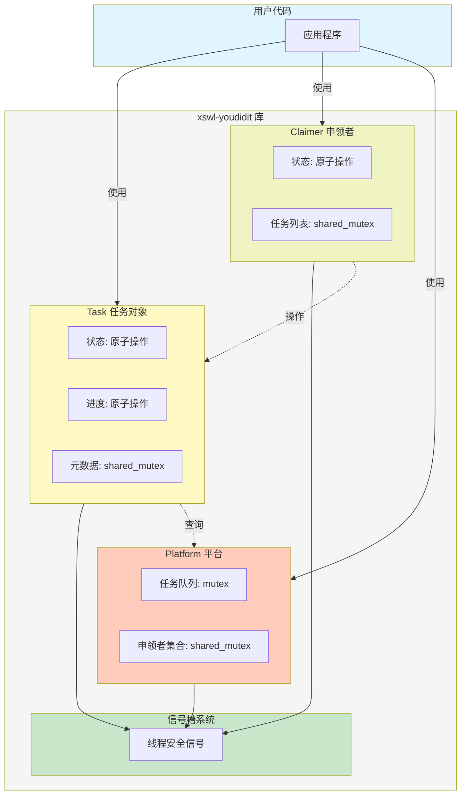

## 🔍 信号槽机制详解

项目采用 [xswl-signals](https://github.com/Wang-Jianwei/xswl-signals.git) 库实现事件驱动，提供类型安全的信号槽机制。

### 核心特性

- **类型安全**：编译期类型检查，槽函数签名灵活
- **参数适配**：槽函数可接受比信号更少的参数
- **优先级调度**：支持按优先级顺序执行槽函数
- **单次连接**：支持 `connect_once` 一次性回调
- **自动生命周期管理**：使用 `shared_ptr` 自动追踪对象生命周期
- **线程安全**：基础线程安全保证，适合一般场景

### 使用模式

```cpp
// 模式 1：Lambda 连接（最常用）
task->sig_status_changed().connect([](TaskStatus status) {
    std::cout << "Task status: " << status.name() << std::endl;
});

// 模式 2：成员函数连接（自动生命周期追踪）
auto handler = std::make_shared<EventHandler>();
task->sig_completed().connect(handler, &EventHandler::on_task_complete);

// 模式 3：优先级调度
claimer->sig_progress_updated().connect([](const TaskId &id, int progress) {
    std::cout << "Progress: " << progress << "%" << std::endl;
}, 100);  // 优先级为 100

// 模式 4：单次执行
task->sig_published().connect_once([](const TaskId &id) {
    std::cout << "Task published first time" << std::endl;
});

// 模式 5：连接管理（RAII 风格）
{
    xswl::scoped_connection_t conn = task->sig_status_changed().connect([](TaskStatus status) {
        std::cout << "Inside scope" << std::endl;
    });
    
    task->set_status(TaskStatus::Processing);  // 触发信号
}  // conn 析构，自动断开连接

task->set_status(TaskStatus::Completed);  // 不会触发之前的回调

// 模式 6：批量管理（连接组）
xswl::connection_group_t conns;
conns += task->sig_status_changed().connect([](TaskStatus status) { /* ... */ });
conns += task->sig_progress_updated().connect([](int progress) { /* ... */ });

conns.disconnect_all();  // 一次性断开所有连接
```

### 信号列表

| 对象 | 信号名 | 参数 | 触发时机 |
|------|--------|------|---------|
| **Task** | `sig_status_changed()` | `TaskStatus` | 任务状态变化 |
| | `sig_progress_updated()` | `int` | 进度更新 |
| | `sig_published()` | `TaskId` | 任务发布 |
| | `sig_claimed()` | `TaskId, string` | 任务被申领 |
| | `sig_started()` | `TaskId` | 开始处理 |
| | `sig_completed()` | `TaskId, TaskResult` | 处理完成 |
| | `sig_failed()` | `TaskId, string` | 处理失败 |
| | `sig_priority_changed()` | `int, int` | 优先级变化 (旧值, 新值) |
| **Claimer** | `sig_task_assigned()` | `shared_ptr<Task>` | 任务分派给申领者 |
| | `sig_task_started()` | `shared_ptr<Task>` | 申领者开始任务 |
| | `sig_progress_updated()` | `TaskId, int` | 任务进度更新 |
| | `sig_task_completed()` | `shared_ptr<Task>, TaskResult` | 任务完成 |
| | `sig_task_failed()` | `shared_ptr<Task>, string` | 任务失败 |
| | `sig_task_abandoned()` | `shared_ptr<Task>, string` | 任务放弃 |
| | `sig_status_changed()` | `ClaimerStatus` | 申领者状态变化 |
| **TaskPlatform** | `sig_task_published()` | `shared_ptr<Task>` | 任务发布到平台 |
| | `sig_task_claimed()` | `shared_ptr<Task>` | 任务被申领 |
| | `sig_task_started()` | `shared_ptr<Task>` | 任务开始处理 |
| | `sig_task_completed()` | `shared_ptr<Task>, TaskResult` | 任务完成 |
| | `sig_task_failed()` | `shared_ptr<Task>, string` | 任务失败 |
| | `sig_task_cancelled()` | `shared_ptr<Task>` | 任务被取消 |
| | `sig_claimer_registered()` | `shared_ptr<Claimer>` | 申领者注册 |
| | `sig_claimer_unregistered()` | `string` | 申领者注销 |

> **注意**：表格中 `shared_ptr<T>` 是 `const std::shared_ptr<T>&` 的简写。

## 🔍 监控与可视化

xswl-youdidit 提供完整的 Web 监控系统，支持实时仪表板、事件日志、时间回放和性能分析。

> **详细文档**：
> - [Web 监控系统设计文档](docs/WEB_MONITORING.md) - 架构设计、部署模式、跨进程通信
> - [Web API 文档](docs/WEB_API.md) - C++ API 和 HTTP REST API 完整参考

### 核心功能

| 功能 | 说明 |
|------|------|
| **实时仪表板** | Web UI 展示任务状态、申领者状态、系统指标 |
| **事件日志** | 记录所有系统事件，支持查询和导出 |
| **时间回放** | 查看任意时刻的系统状态（Time Travel Debugging） |
| **性能分析** | 任务处理时间、申领者效率、系统吞吐量分析 |
| **数据导出** | JSON、CSV 格式导出，支持生成报告 |

### 解耦设计

Web 监控系统与核心任务调度完全解耦：

```
┌─────────────────┐       ┌─────────────────┐
│  TaskPlatform   │──────▶│  WebDashboard   │  (可选组件)
│  (核心调度)      │       │  (监控可视化)    │
└─────────────────┘       └─────────────────┘
```

- **按需启用**：不需要监控时零开销
- **故障隔离**：监控崩溃不影响核心业务
- **灵活部署**：支持同进程、独立进程、远程监控

### 快速开始

```cpp
// 创建平台
auto platform = std::make_shared<TaskPlatform>();

// 创建独立的 Web 仪表板
auto dashboard = std::make_shared<WebDashboard>(platform.get());
dashboard->set_update_interval(1000)
         ->set_max_event_history(10000)
         ->start_server(8080);

// 访问 http://localhost:8080 查看仪表板
std::cout << "Dashboard: http://localhost:8080" << std::endl;

// 获取实时指标
auto metrics = dashboard->get_metrics();
std::cout << "完成率: " << metrics.task_completion_rate * 100 << "%" << std::endl;

// 时间回放
auto replay = dashboard->get_time_replay();
auto snapshot = replay->get_snapshot_at(Timestamp::now() - std::chrono::minutes(30));
```

### 部署模式

| 模式 | 说明 | 适用场景 |
|------|------|----------|
| **同进程** | Dashboard 与 Platform 在同一进程 | 开发环境、小型部署 |
| **独立进程** | Dashboard 作为独立监控服务 | 生产环境、故障隔离 |
| **集中监控** | 一个 Dashboard 监控多个 Platform | 分布式部署、统一运维 |

> 详细的部署架构和跨进程通信设计请参阅 [Web 监控系统设计文档](docs/WEB_MONITORING.md)

## 📦 依赖库

- **tl::optional** - 可选值处理，支持现代 C++ 风格的可选类型
- **tl::expected** - 优雅的错误处理，提供 Result 类型语义
- **xswl-signals** - 信号槽机制，实现类型安全的事件系统

## 🎯 现代 C++ 特性

项目充分利用 C++11 及更新特性：

| 特性 | 用途 |
|------|------|
| **智能指针** | 自动内存管理，避免手动 delete |
| **Lambda 表达式** | 灵活的回调和事件处理 |
| **Move 语义** | 高效的资源转移和避免拷贝 |
| **std::function** | 类型擦除的函数包装 |
| **Fluent API** | 链式调用，提升代码可读性 |
| **Builder 模式** | 复杂对象的灵活构建 |
| **Result/Optional** | 函数式的错误处理 |

## 📝 使用示例

### 基础示例（Fluent API 风格）

```cpp
#include <xswl/youdidit.hpp>
#include <memory>

using namespace xswl::youdidit;

// 创建并配置任务平台
auto platform = std::make_shared<TaskPlatform>();
platform->set_log_file("platform.log");

// 使用 Fluent API 发布任务（携带业务逻辑）
auto task = platform->task_builder()
    .title("Process Data")
    .priority(5)
    .description("处理用户数据")
    .assign_to_role("DataProcessor")
    .handler([](Task &task, const std::string &input) -> tl::expected<TaskResult, std::string> {
        // 发布者定义任务要做什么
        try {
            // 阶段1：加载数据
            task.set_progress(20);
            auto data = load_data(input);  // input 可以是文件路径或 JSON 字符串
            
            // 阶段2：处理数据
            task.set_progress(60);
            auto processed = process_data(data);
            
            // 阶段3：保存结果
            task.set_progress(90);
            save_result(processed);
            
            // 返回结果
            TaskResult result;
            result.success = true;
            result.summary = "Data processed successfully";
            return result;
            
        } catch (const std::exception &e) {
            return tl::unexpected(std::string("Error: ") + e.what());
        }
    })
    .build();

// 申领任务
auto claimer = std::make_shared<Claimer>("Worker-001");
auto result = claimer->claim_task(task.id());

if (result) {
    // 申领者只需提供输入数据，执行任务定义的业务逻辑
    std::string input = "/data/input.csv";  // 输入数据，可以是路径、JSON 字符串等
    
    auto exec_result = claimer->execute_task(task.id(), input);
    if (exec_result) {
        std::cout << "Task executed successfully!" << std::endl;
    } else {
        std::cerr << "Execution failed: " << exec_result.error() << std::endl;
    }
} else {
    std::cerr << "Failed to claim task: " << result.error() << std::endl;
}
```

### 高级示例（事件驱动）

```cpp
// 创建平台和处理者
auto platform = std::make_shared<TaskPlatform>();

// 订阅任务发布事件
platform->sig_task_published().connect([](const std::shared_ptr<Task>& task) {
    std::cout << "New task published: " << task->title() << std::endl;
});

// 订阅任务完成事件
platform->sig_task_completed().connect([](const std::shared_ptr<Task>& task, const Result& result) {
    std::cout << "✓ Task " << task->id() << " completed" << std::endl;
});

// 发布多个任务，每个任务都携带自己的业务逻辑
for (int i = 0; i < 10; ++i) {
    auto task = platform->task_builder()
        .title("Task " + std::to_string(i))
        .priority(i % 3 + 1)
        .handler([i](Task &task, const std::string &input) -> tl::expected<TaskResult, std::string> {
            // 每个任务有自己特定的处理逻辑
            std::cout << "Executing task " << i << std::endl;
            
            task.set_progress(50);
            // ... 具体业务处理 ...
            
            TaskResult result;
            result.summary = "Task " + std::to_string(i) + " completed";
            return result;
        })
        .build();
}

// 创建多个申领者，它们只负责执行，不决定做什么
std::vector<std::string> workers = {"Worker-001", "Worker-002", "Worker-003"};
for (const auto &worker_id : workers) {
    auto claimer = std::make_shared<Claimer>(worker_id);
    
    // 申领者自动处理分配给它的任务
    claimer->sig_task_assigned().connect([claimer](const Task &task) {
        // 从任务元数据中获取输入参数
        auto input = task.metadata.at("input");
        
        // 执行任务定义的业务逻辑
        claimer->execute_task(task.id(), input);
    });
}
```

### Web 监控示例

详细的 Web 监控使用方式，请参阅：
- 📘 [Web 监控设计](docs/WEB_MONITORING.md) - 架构设计与部署模式
- 📗 [Web API 文档](docs/WEB_API.md) - 完整 API 参考

基础示例：

```cpp
// 创建平台
auto platform = std::make_shared<TaskPlatform>();

// 创建独立的 Web 仪表板（解耦设计）
auto dashboard = std::make_shared<WebDashboard>(platform.get());

// 启动 Web 服务器
dashboard->start_server(8080);

// 获取仪表板数据
std::string data = dashboard->get_dashboard_data();
```

---

**© 2026 xswl-youdidit Project** | **MIT License**

## 🤝 贡献指南

欢迎提交 Issue 和 Pull Request！

1. Fork 本仓库
2. 创建特性分支 (`git checkout -b feature/AmazingFeature`)
3. 提交更改 (`git commit -m 'Add some AmazingFeature'`)
4. 推送到分支 (`git push origin feature/AmazingFeature`)
5. 开启 Pull Request

## 📄 许可证

本项目采用 MIT 许可证，详见 LICENSE 文件。

---

**开发者**: [Wang-Jianwei](https://github.com/Wang-Jianwei)

**最后更新**: 2026-01-27