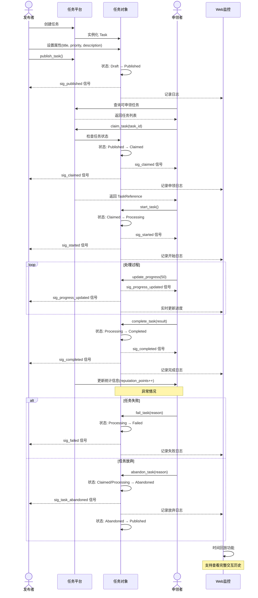

# xswl-youdidit

一个高性能的任务代理平台库，采用赏金榜游戏机制，支持多角色任务交互与实时监控。

## 📋 项目简介

**xswl-youdidit** 是一个任务分布式处理平台，模拟真实世界的赏金榜系统。通过游戏化的任务交互机制，支持任务发布者、申领者、分派者等多角色协作，实现高效的异步任务处理与状态追踪。

### 设计理念

- **游戏化机制**：借鉴赏金榜游戏模式，使任务交互更加直观有趣
- **实时监控**：完整的日志记录和 Web 可视化工具，支持时间回放功能
- **高性能并发**：支持大规模并发任务处理和动态调度

## 技术栈

- **编程语言**: C++11
- **编译工具**: CMake
- **编译器**: MinGW
- **依赖库**: tl::optional、tl::expected 等第三方库

## 核心特性

### 任务发布与申领
- 任务发布者可以发布任务到平台
- 支持等待任务申领结果、处理结果、状态反馈
- 申领者负责处理任务并反馈执行状态
- 支持任务分派，发布者可指定特定处理者

### 并发与调度
- 支持任意多个任务申领者同时处理各种任务
- 支持设置和实时调整任务优先级
- 支持多角色并发交互

### 架构设计
- 采用信号槽机制（使用 [xswl-signals](https://github.com/Wang-Jianwei/xswl-signals.git) 库）
- 游戏化设计风格，类似真实世界的赏金榜模式
- 代码接口命名贴近赏金榜游戏角色

### 监控与日志
- 记录各角色交互日志和状态到状态文件
- 提供 Web 工具实时查看系统状态
- 支持时间回放功能，如同游戏仿真界面

## 🚀 快速开始

### 前置要求

- C++11 或更高版本
- CMake 3.10+
- MinGW 工具链（Windows 开发）

### 构建项目

```bash
mkdir build
cd build
cmake ..
make
```

### 基本使用流程

1. **发布任务**：任务发布者创建任务并提交到平台
2. **申领任务**：处理者查看并申领合适的任务
3. **执行处理**：申领者处理任务并反馈状态
4. **监控查看**：通过 Web 工具实时监控任务进展和系统状态

### 设计模式

采用现代 C++ 设计模式：

- **Fluent API**：链式调用，提高代码可读性
- **智能指针**：自动内存管理，避免内存泄漏
- **函数式回调**：使用 Lambda 表达式处理事件
- **Result 类型**：使用 `tl::expected` 进行优雅的错误处理

## 🏗️ 项目结构

```
xswl-youdidit/
├── include/          # 头文件
├── src/              # 源代码实现
├── tests/            # 测试代码
├── web/              # Web 监控工具
├── CMakeLists.txt    # 构建配置
└── README.md         # 本文件
```

## 📖 核心概念

### 任务定义

任务（Task）是平台的核心实体，代表需要处理的工作单元。

#### 任务属性

```cpp
class Task {
public:
    // 基本信息
    TaskId id;                    // 唯一标识符
    std::string title;            // 任务标题
    std::string description;      // 详细描述
    
    // 优先级和分类
    int priority;                 // 优先级（1-10，数值越大优先级越高）
    std::string category;         // 任务类别
    std::vector<std::string> tags; // 任务标签
    
    // 角色相关
    std::string publisher_id;     // 发布者ID
    tl::optional<std::string> assignee_id;  // 指定处理者（可选）
    tl::optional<std::string> claimer_id;   // 实际申领者（可选）
    std::string required_role;    // 要求的角色类型
    
    // 状态和进度
    TaskStatus status;            // 当前状态
    int progress;                 // 完成进度（0-100）
    
    // 时间信息
    Timestamp created_at;         // 创建时间
    Timestamp published_at;       // 发布时间
    tl::optional<Timestamp> claimed_at;    // 申领时间
    tl::optional<Timestamp> started_at;    // 开始处理时间
    tl::optional<Timestamp> completed_at;  // 完成时间
    Timestamp deadline;           // 截止时间
    
    // 结果和数据
    tl::optional<TaskResult> result;       // 任务结果
    std::map<std::string, std::string> metadata;  // 元数据
    
    // 奖励信息（赏金榜特色）
    int reward_points;            // 奖励积分
    std::string reward_type;      // 奖励类型
    
    // ============ 信号槽机制 ============
    
    // 任务状态变化信号
    xswl::signal_t<TaskStatus>& sig_status_changed();
    
    // 进度更新信号
    xswl::signal_t<int>& sig_progress_updated();
    
    // 任务发布信号（发布者发布时触发）
    xswl::signal_t<const TaskId&>& sig_published();
    
    // 任务申领信号
    xswl::signal_t<const TaskId&, const std::string&>& sig_claimed();
    
    // 任务开始信号
    xswl::signal_t<const TaskId&>& sig_started();
    
    // 任务完成信号
    xswl::signal_t<const TaskId&, const TaskResult&>& sig_completed();
    
    // 任务失败信号
    xswl::signal_t<const TaskId&, const std::string&>& sig_failed();
    
    // 优先级调整信号
    xswl::signal_t<int, int>& sig_priority_changed();
};

// 便利方法（Fluent API）
class Task {
public:
    // ...其他方法...
    
    // 使用 Fluent API 更新状态并自动触发信号
    Task& set_status(TaskStatus status);
    Task& set_progress(int progress);
    Task& set_priority(int new_priority);
    Task& set_result(const TaskResult& result);
};
```

#### 任务状态（TaskStatus）

任务在生命周期中会经历以下状态：

| 状态 | 枚举值 | 描述 | 可转换到 |
|------|--------|------|----------|
| **待发布** | `Draft` | 任务已创建，尚未发布到平台 | Published |
| **已发布** | `Published` | 任务已发布，等待申领 | Claimed, Cancelled |
| **已申领** | `Claimed` | 已被处理者申领，准备开始 | Processing, Abandoned |
| **处理中** | `Processing` | 正在执行处理 | Paused, Completed, Failed |
| **暂停** | `Paused` | 暂时停止处理 | Processing, Abandoned |
| **已完成** | `Completed` | 任务成功完成 | - |
| **失败** | `Failed` | 任务处理失败 | Published, Abandoned |
| **已取消** | `Cancelled` | 发布者取消任务 | - |
| **已放弃** | `Abandoned` | 申领者放弃任务 | Published |

#### 状态转换图

```
Draft ──→ Published ──→ Claimed ──→ Processing ──→ Completed
           │             │           │
           ↓             ↓           ↓
        Cancelled    Abandoned    Failed ──→ Published
                                      │
                                      ↓
                                  Paused
```

### 角色定义

| 角色 | 职责 | 功能 |
|------|------|------|
| **发布者** | 创建任务 | 发布、分派、监控任务 |
| **申领者** | 处理任务 | 申领、执行、反馈状态 |
| **分派者** | 指定处理者 | 精准分配任务给特定申领者 |

### 申领者定义（Claimer）

申领者（Claimer）是任务的实际执行者，负责从平台申领并处理任务。

#### 申领者属性

```cpp
class Claimer {
public:
    // 基本信息
    std::string id;               // 申领者唯一标识
    std::string name;             // 申领者名称
    std::string role;             // 角色类型（如 "DataProcessor", "Analyst"）
    
    // 能力信息
    std::vector<std::string> skills;      // 技能列表
    std::set<std::string> categories;     // 可处理的任务类别
    int max_concurrent_tasks;             // 最大并发任务数
    
    // 状态信息
    ClaimerStatus status;         // 当前状态（空闲/忙碌/离线）
    int active_task_count;        // 当前处理任务数
    std::vector<TaskId> claimed_tasks;    // 已申领的任务列表
    
    // 统计信息
    int total_completed;          // 累计完成任务数
    int total_failed;             // 累计失败任务数
    int total_abandoned;          // 累计放弃任务数
    double success_rate;          // 成功率
    int reputation_points;        // 声望值（赏金榜特色）
    int total_rewards;            // 累计获得奖励
    
    // 时间信息
    Timestamp registered_at;      // 注册时间
    Timestamp last_active_at;     // 最后活跃时间
};
```

#### 申领者状态（ClaimerStatus）

| 状态 | 枚举值 | 描述 |
|------|--------|------|
| **空闲** | `Idle` | 可以申领新任务 |
| **忙碌** | `Busy` | 已达到最大并发任务数 |
| **离线** | `Offline` | 暂时不可用 |
| **暂停** | `Paused` | 暂停接受新任务 |

#### 申领者核心方法

申领者使用**信号槽机制**（[xswl-signals](https://github.com/Wang-Jianwei/xswl-signals.git) 库）暴露关键事件：

```cpp
class Claimer {
public:
    // 构造函数
    Claimer(const std::string& id, const std::string& name);
    
    // 任务申领
    tl::expected<TaskReference, Error> claim_task(const TaskId& task_id);
    tl::expected<TaskReference, Error> try_claim(const TaskId& task_id);
    
    // 任务处理
    tl::expected<void, Error> start_task(const TaskId& task_id);
    tl::expected<void, Error> update_progress(const TaskId& task_id, int progress);
    tl::expected<void, Error> complete_task(const TaskId& task_id, const TaskResult& result);
    tl::expected<void, Error> fail_task(const TaskId& task_id, const std::string& reason);
    tl::expected<void, Error> abandon_task(const TaskId& task_id, const std::string& reason);
    
    // 状态管理
    Claimer& set_status(ClaimerStatus status);
    Claimer& set_max_concurrent(int max_count);
    bool can_claim_more() const;
    
    // 查询方法
    std::vector<Task> get_active_tasks() const;
    tl::optional<Task> get_task(const TaskId& task_id) const;
    Statistics get_statistics() const;
    
    // ============ 信号槽机制 ============
    
    // 任务已分配信号（当任务被分派或发布者指定此申领者时触发）
    xswl::signal_t<const Task&>& sig_task_assigned();
    
    // 任务开始信号
    xswl::signal_t<const Task&>& sig_task_started();
    
    // 任务进度更新信号
    xswl::signal_t<const TaskId&, int>& sig_progress_updated();
    
    // 任务完成信号
    xswl::signal_t<const Task&, const TaskResult&>& sig_task_completed();
    
    // 任务失败信号
    xswl::signal_t<const Task&, const std::string&>& sig_task_failed();
    
    // 任务放弃信号
    xswl::signal_t<const Task&, const std::string&>& sig_task_abandoned();
    
    // 申领者状态变化信号
    xswl::signal_t<ClaimerStatus>& sig_status_changed();
};
```

#### 使用示例

```cpp
// 创建申领者
auto claimer = std::make_shared<Claimer>("worker-001", "Alice")
    ->set_role("DataProcessor")
    ->add_skill("data_analysis")
    ->add_skill("machine_learning")
    ->set_max_concurrent(5);

// 使用信号槽机制注册事件回调
claimer->sig_task_assigned().connect([](const Task& task) {
    std::cout << "New task assigned: " << task.title << std::endl;
});

claimer->sig_progress_updated().connect([](const TaskId& task_id, int progress) {
    std::cout << "Task " << task_id << " progress: " << progress << "%" << std::endl;
}, 10);  // 优先级为 10

claimer->sig_task_completed().connect([](const Task& task, const TaskResult& result) {
    std::cout << "Task completed: " << task.title << std::endl;
    std::cout << "Result: " << result.summary << std::endl;
});

claimer->sig_task_failed().connect([](const Task& task, const std::string& reason) {
    std::cout << "Task failed: " << task.title << " - " << reason << std::endl;
});

claimer->sig_status_changed().connect([](ClaimerStatus status) {
    std::cout << "Status changed to: " << status.to_string() << std::endl;
}, 5);

// 申领任务
auto result = claimer->claim_task(task_id);
if (result) {
    auto task_ref = result.value();
    
    // 开始处理
    task_ref.start();
    
    // 更新进度
    task_ref.update_progress(50);  // 触发 sig_progress_updated 信号
    
    // 完成任务
    task_ref.complete("Processing completed successfully");  // 触发 sig_task_completed 信号
} else {
    std::cerr << "Claim failed: " << result.error() << std::endl;
}
```

### 任务生命周期

1. **待发布** → 任务创建初始状态
2. **已发布** → 任务进入平台，等待申领
3. **已申领** → 申领者开始处理
4. **处理中** → 任务执行阶段，定期反馈状态
5. **已完成** → 任务处理完成，反馈最终结果

### 交互流程图

以下泳道图展示了任务从发布到完成的完整交互流程：



**流程说明**：

1. **任务发布阶段**：发布者创建任务并发布到平台，触发 `sig_published` 信号
2. **任务申领阶段**：申领者查询并申领任务，触发 `sig_claimed` 信号通知发布者和申领者
3. **任务处理阶段**：申领者开始处理并定期更新进度，通过 `sig_progress_updated` 实时反馈
4. **任务完成阶段**：成功完成触发 `sig_completed` 信号，系统更新申领者声望值
5. **异常处理**：支持任务失败或放弃，放弃后任务重新回到已发布状态等待其他申领者
6. **Web监控**：全程记录日志，支持时间回放查看完整交互历史

*注：图中虚线箭头(`-->>`)表示信号槽的异步通知，实线箭头(`->>`)表示直接方法调用*

## 💡 主要特性详解

### 多优先级调度

支持动态设置和调整任务优先级，确保高优先级任务优先处理：

- **实时调整**：可在任务处理前后调整优先级
- **公平调度**：相同优先级任务按 FIFO 处理
- **优先级范围**：支持自定义优先级数值范围

### 并发处理

- 支持多个申领者同时处理不同任务
- 线程安全的任务分配和状态同步
- 自动处理并发冲突和资源竞争

## 🔍 信号槽机制详解

项目采用 [xswl-signals](https://github.com/Wang-Jianwei/xswl-signals.git) 库实现事件驱动，提供类型安全的信号槽机制。

### 核心特性

- **类型安全**：编译期类型检查，槽函数签名灵活
- **参数适配**：槽函数可接受比信号更少的参数
- **优先级调度**：支持按优先级顺序执行槽函数
- **单次连接**：支持 `connect_once` 一次性回调
- **自动生命周期管理**：使用 `shared_ptr` 自动追踪对象生命周期
- **线程安全**：基础线程安全保证，适合一般场景

### 使用模式

```cpp
// 模式 1：Lambda 连接（最常用）
task->sig_status_changed().connect([](TaskStatus status) {
    std::cout << "Task status: " << status.name() << std::endl;
});

// 模式 2：成员函数连接（自动生命周期追踪）
auto handler = std::make_shared<EventHandler>();
task->sig_completed().connect(handler, &EventHandler::on_task_complete);

// 模式 3：优先级调度
claimer->sig_progress_updated().connect([](const TaskId& id, int progress) {
    std::cout << "Progress: " << progress << "%" << std::endl;
}, 100);  // 优先级为 100

// 模式 4：单次执行
task->sig_published().connect_once([](const TaskId& id) {
    std::cout << "Task published first time" << std::endl;
});

// 模式 5：连接管理（RAII 风格）
{
    xswl::scoped_connection_t conn = task->sig_status_changed().connect([](TaskStatus status) {
        std::cout << "Inside scope" << std::endl;
    });
    
    task->set_status(TaskStatus::Processing);  // 触发信号
}  // conn 析构，自动断开连接

task->set_status(TaskStatus::Completed);  // 不会触发之前的回调

// 模式 6：批量管理（连接组）
xswl::connection_group_t conns;
conns += task->sig_status_changed().connect([](TaskStatus status) { /* ... */ });
conns += task->sig_progress_updated().connect([](int progress) { /* ... */ });

conns.disconnect_all();  // 一次性断开所有连接
```

### 信号列表

| 对象 | 信号名 | 参数 | 触发时机 |
|------|--------|------|---------|
| **Task** | `sig_status_changed()` | `TaskStatus` | 任务状态变化 |
| | `sig_progress_updated()` | `int` | 进度更新 |
| | `sig_published()` | `TaskId` | 任务发布 |
| | `sig_claimed()` | `TaskId, string` | 任务被申领 |
| | `sig_started()` | `TaskId` | 开始处理 |
| | `sig_completed()` | `TaskId, TaskResult` | 处理完成 |
| | `sig_failed()` | `TaskId, string` | 处理失败 |
| | `sig_priority_changed()` | `int, int` | 优先级变化 |
| **Claimer** | `sig_task_assigned()` | `Task` | 任务分派 |
| | `sig_task_started()` | `Task` | 任务开始 |
| | `sig_progress_updated()` | `TaskId, int` | 进度更新 |
| | `sig_task_completed()` | `Task, TaskResult` | 任务完成 |
| | `sig_task_failed()` | `Task, string` | 任务失败 |
| | `sig_task_abandoned()` | `Task, string` | 任务放弃 |
| | `sig_status_changed()` | `ClaimerStatus` | 申领者状态变化 |

## 🔍 监控与可视化

### 状态文件

系统自动记录所有操作日志到状态文件，包括：
- 任务发布/申领/完成事件
- 优先级调整记录
- 各角色交互历史

### Web 工具功能

- **实时仪表板**：展示当前任务分布、申领者状态
- **时间回放**：通过时间轴查看任务处理过程
- **交互日志**：详细的操作和状态变化记录

## 📦 依赖库

- **tl::optional** - 可选值处理，支持现代 C++ 风格的可选类型
- **tl::expected** - 优雅的错误处理，提供 Result 类型语义
- **xswl-signals** - 信号槽机制，实现类型安全的事件系统

## 🎯 现代 C++ 特性

项目充分利用 C++11 及更新特性：

| 特性 | 用途 |
|------|------|
| **智能指针** | 自动内存管理，避免手动 delete |
| **Lambda 表达式** | 灵活的回调和事件处理 |
| **Move 语义** | 高效的资源转移和避免拷贝 |
| **std::function** | 类型擦除的函数包装 |
| **Fluent API** | 链式调用，提升代码可读性 |
| **Builder 模式** | 复杂对象的灵活构建 |
| **Result/Optional** | 函数式的错误处理 |

## 📝 使用示例

### 基础示例（Fluent API 风格）

```cpp
#include <xswl/youdidit.hpp>
#include <memory>

using namespace xswl::youdidit;

// 创建并配置任务平台
auto platform = std::make_shared<TaskPlatform>()
    ->set_log_file("platform.log")
    ->enable_web_server(8080);

// 使用 Fluent API 发布任务
auto task = platform->task_builder()
    .title("Process Data")
    .priority(5)
    .description("处理用户数据")
    .assign_to_role("DataProcessor")
    .build();

// 申领任务
auto claimer = std::make_shared<Claimer>("Worker-001");
auto result = claimer->claim_task(task.id());

if (result) {
    // 任务申领成功
    auto task_ref = result.value();
    
    // 注册状态变化回调
    task_ref.on_status_change([](const TaskStatus& status) {
        std::cout << "Task status: " << status.name() << std::endl;
    });
    
    // 更新任务状态（Fluent 风格）
    task_ref.status(TaskStatus::Processing)
            .progress(25)
            .update();
    
    task_ref.status(TaskStatus::Completed)
            .result("Data processed successfully")
            .update();
} else {
    // 处理申领失败
    std::cerr << "Failed to claim task: " << result.error() << std::endl;
}
```

### 高级示例（事件驱动）

```cpp
// 创建平台和处理者
auto platform = std::make_shared<TaskPlatform>();
auto handler = std::make_shared<EventHandler>();

// 订阅任务发布事件
platform->sig_task_published().connect([handler](const Task& task) {
    handler->process_new_task(task);
});

// 订阅任务完成事件
platform->sig_task_completed().connect([](const Task& task, const Result& result) {
    std::cout << "✓ Task " << task.id() << " completed" << std::endl;
});

// 发布任务
std::vector<std::string> workers = {"Worker-001", "Worker-002", "Worker-003"};

for (int i = 0; i < 10; ++i) {
    auto task = platform->task_builder()
        .title("Task " + std::to_string(i))
        .priority(i % 3 + 1)
        .build();
    
    // 让任意可用的处理者申领
    for (const auto& worker : workers) {
        auto claimer = std::make_shared<Claimer>(worker);
        if (auto res = claimer->try_claim(task.id())) {
            break;  // 申领成功，退出循环
        }
    }
}
```

### Web 监控示例

```cpp
// 启用 Web 可视化工具
auto platform = std::make_shared<TaskPlatform>()
    ->enable_web_dashboard(8080)
    ->enable_time_replay();

// 访问 http://localhost:8080 查看实时仪表板
// 支持时间回放、交互日志查看等功能
```

## 🤝 贡献指南

欢迎提交 Issue 和 Pull Request！

1. Fork 本仓库
2. 创建特性分支 (`git checkout -b feature/AmazingFeature`)
3. 提交更改 (`git commit -m 'Add some AmazingFeature'`)
4. 推送到分支 (`git push origin feature/AmazingFeature`)
5. 开启 Pull Request

## 📄 许可证

本项目采用 MIT 许可证，详见 LICENSE 文件。

---

**开发者**: [Wang-Jianwei](https://github.com/Wang-Jianwei)

**最后更新**: 2026-01-26