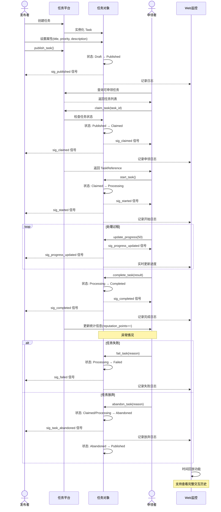

# 核心概念与设计（详解）

本文档从概念层面详细说明 `xswl-youdidit` 的设计原则、对象模型、任务生命周期与线程安全策略，适合需要理解内部语义与设计决策的读者。

## 目录
- 项目设计理念
- 任务（Task）与 TaskHandler
- 任务状态与生命周期
- 角色（发布者 / 申领者 / 分派者）
- 交互流程（序列图）
- 线程安全设计（原则与机制）
- 信号槽机制（事件系统）

---

## 项目设计理念

见 `README.md` 中的简要概述；这里重点说明一些设计决策的原因与约束：

- 单一职责：任务携带业务逻辑，申领者只负责执行。
- 可观测性：全链路日志、事件与时间回放支持调试与审计。
- 可扩展性：采用 Pimpl、接口化设计，便于未来扩展 Executor / TraceProvider 等。

---

## 任务（Task）与 TaskHandler

任务是系统的核心实体，包含状态、进度与元数据；业务逻辑通过 `TaskHandler` 由发布者定义：

```cpp
using TaskHandler = std::function<TaskResult(
    Task &task,
    const std::string &input
)>;
```

处理失败请返回包含错误信息的 `TaskResult` 或 `tl::expected` 风格错误。

---

## 任务状态与生命周期

任务遵循一组明确定义的状态（Draft, Published, Claimed, Processing, Paused, Completed, Failed, Cancelled, Abandoned），并在不同场景下做出有效的状态转换。时间点与修订由 Task 对象记录。

（详情请参阅本文件下方的状态转换图与说明）

---

## 角色

- 发布者（Publisher）：创建与发布任务
- 申领者（Claimer）：申领并执行任务
- 分派者（Dispatcher）：可指定任务处理者

每个角色拥有各自的权限与交互边界，参见 API 文档中的对应类说明。

---

## 交互流程（序列图）

以下 Mermaid 序列图展示了从任务发布到完成的完整交互流程：



---

## 线程安全设计

项目以线程安全为首要目标，采用：

- 细粒度锁（`std::shared_mutex` 与 `std::mutex`）
- 原子类型 (`std::atomic`) 用于频繁更新的基本属性（如进度、状态）
- 明确的加锁顺序以避免死锁（例如：`platform_mutex` -> `task_mutex` -> `data_mutex`）

并在文档中给出最佳实践、验证方法（ThreadSanitizer、压力测试、CI）与示例代码片段，便于开发者参考。

---

## 信号槽机制

事件驱动使用 `xswl-signals`，提供类型安全的信号/槽链接、优先级、一次性连接和自动生命周期管理。信号语义（同步/异步）与回调约定在 API 文档中有明确说明（推荐在回调中避免长时间阻塞或使用异步 offload）。

---

## 参考

- API 参考：`API.md`
- 使用示例：`docs/usage.md`
- 开发计划与阶段报告：`docs/architecture/DEVELOPMENT_PLAN.md`、`docs/architecture/PHASE1_REPORT.md` 等
